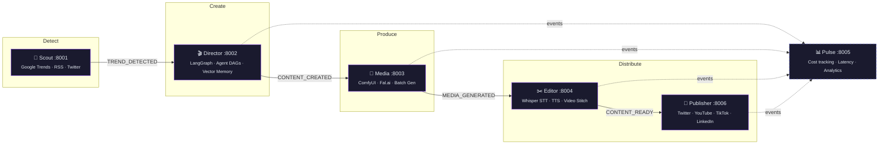
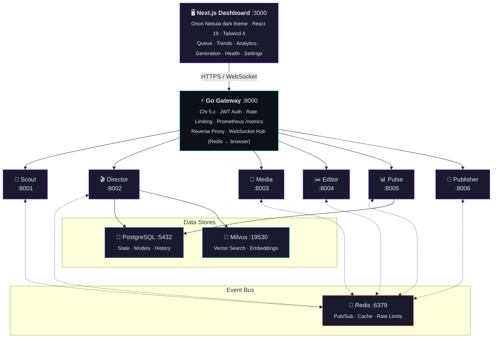
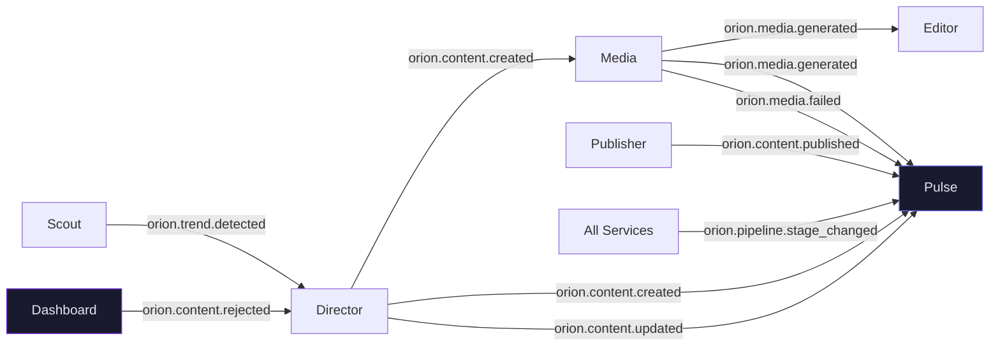
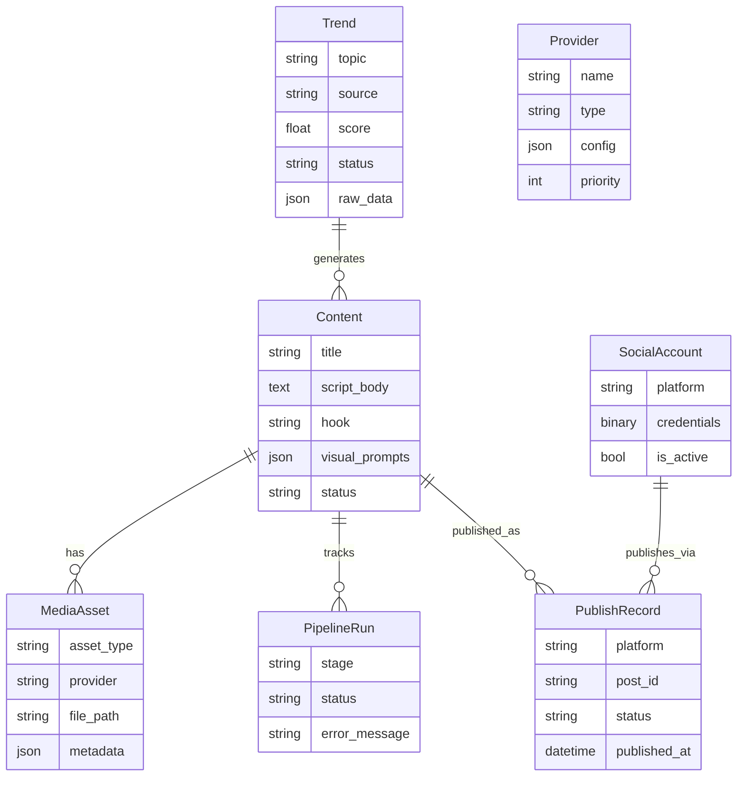

<div align="center">


# Orion

**Autonomous AI Content Agency — from trend to publish, zero human bottleneck.**

[](https://go.dev)
[](https://python.org)
[](https://nextjs.org)
[](https://react.dev)
[](https://tailwindcss.com)
[](https://fastapi.tiangolo.com)
[](https://postgresql.org)
[](https://redis.io)
[](https://docs.docker.com/compose/)
[](#license)

<br />

Orion is a **Digital Twin Content Agency** — a swarm of specialized AI microservices that autonomously detect trends, write scripts, generate media, assemble videos, and publish across social platforms. A Go gateway orchestrates everything while a dark-themed Next.js dashboard gives operators full visibility and control.

<br />

[Getting Started](#-getting-started) ·
[Architecture](#-architecture) ·
[Services](#-services) ·
[Dashboard](#-dashboard) ·
[Development](#-development) ·
[Deployment](#-deployment) ·
[Tech Stack](#-tech-stack)

</div>

<br />

---

<br />

## How It Works



> Every arrow is a **Redis pub/sub event**. Services are fully decoupled — add, remove, or scale any service independently.

<br />

## Architecture



<br />

<table>
<tr>
<td width="50%">

### Monorepo Structure

```
orion/
├── cmd/
│   ├── gateway/          # Go HTTP gateway
│   └── cli/              # Go CLI tool
├── internal/
│   ├── gateway/          # Handlers, middleware, proxy
│   └── cli/              # Commands, client, output
├── pkg/                  # Shared Go packages
├── services/
│   ├── scout/            # Trend detection
│   ├── director/         # Pipeline orchestration
│   ├── media/            # Image generation
│   ├── editor/           # Video assembly + TTS
│   ├── pulse/            # Analytics engine
│   └── publisher/        # Social publishing
├── libs/
│   └── orion-common/     # Shared Python library
├── dashboard/            # Next.js admin UI
├── deploy/               # Docker Compose + configs
├── migrations/           # Database migrations
├── docs/                 # Documentation site
└── tests/                # Integration tests
```

</td>
<td width="50%">

### Design Principles

**Event-Driven** — Services communicate exclusively through Redis pub/sub events (`orion.*` channels). No direct HTTP calls between services.

**AI-Native, No Vendor Lock-in** — Local-first with Ollama (LLM) and ComfyUI (images). Strategy pattern allows swapping to cloud providers without code changes.

**Single Entry Point** — The Go gateway is the only externally-exposed service. It handles auth, rate limiting, proxying, WebSocket broadcast, and metrics.

**Repository Pattern** — All data access goes through repository interfaces. Routes call services, services call repositories.

**Observable** — Prometheus metrics, structured logging (slog/structlog), health checks on every service, real-time WebSocket dashboard updates.

</td>
</tr>
</table>

<br />

## Services

<table>
<tr>
<th width="15%">Service</th>
<th width="8%">Port</th>
<th width="8%">Lang</th>
<th width="69%">Description</th>
</tr>

<tr>
<td><strong>Gateway</strong></td>
<td><code>8000</code></td>
<td>Go</td>
<td>Central HTTP gateway with Chi 5.x router, JWT authentication, per-service rate limiting (Redis-backed), reverse proxy to all downstream services, WebSocket hub broadcasting Redis events to browser clients, and Prometheus metrics export.</td>
</tr>

<tr>
<td><strong>Scout</strong></td>
<td><code>8001</code></td>
<td>Python</td>
<td>Trend detection engine. Polls Google Trends, RSS feeds, Twitter/X, and news APIs on a schedule (APScheduler). Scores topics by relevance, deduplicates with fuzzy matching, applies niche-specific filtering, and emits <code>TREND_DETECTED</code> events.</td>
</tr>

<tr>
<td><strong>Director</strong></td>
<td><code>8002</code></td>
<td>Python</td>
<td>Pipeline orchestrator powered by LangGraph. Spawns AI agent workflows — AnalystAgent (content briefs), ScriptGenerator (video scripts with vector memory), CritiqueAgent (quality review), VisualPrompter (image prompts). Persists execution state in PostgreSQL.</td>
</tr>

<tr>
<td><strong>Media</strong></td>
<td><code>8003</code></td>
<td>Python</td>
<td>Image generation via ComfyUI WebSocket or Fal.ai cloud fallback. Batch generation with concurrency control (max 3 parallel). Stores asset metadata and file paths, emits <code>MEDIA_GENERATED</code> / <code>MEDIA_FAILED</code> events.</td>
</tr>

<tr>
<td><strong>Editor</strong></td>
<td><code>8004</code></td>
<td>Python</td>
<td>Video assembly pipeline. Text-to-speech via configurable providers, automatic caption generation (Faster-Whisper STT), image-to-video stitching, subtitle burning, thumbnail extraction, and codec/bitrate validation.</td>
</tr>

<tr>
<td><strong>Pulse</strong></td>
<td><code>8005</code></td>
<td>Python</td>
<td>Analytics engine subscribing to all event channels. Tracks per-stage latency, success rates, failure modes, GPU/API costs. Scheduled cleanup of records older than 90 days. Powers the dashboard analytics charts.</td>
</tr>

<tr>
<td><strong>Publisher</strong></td>
<td><code>8006</code></td>
<td>Python</td>
<td>Social media publishing. Manages connected accounts (Twitter/X, YouTube, TikTok, LinkedIn) with encrypted credential storage. Content safety checks, platform-native API posting, and publish history tracking.</td>
</tr>

<tr>
<td><strong>Dashboard</strong></td>
<td><code>3000</code></td>
<td>TypeScript</td>
<td>Next.js 15 admin UI with App Router and React 19. Dark "Orion Nebula" design system. Content queue, trend explorer, generation progress, service health, GPU monitoring, provider settings, video preview, and analytics charts (Recharts).</td>
</tr>
</table>

<br />

### Event Flow

Services communicate through Redis pub/sub channels. Each event triggers the next stage in the pipeline:



<br />

## Dashboard

<table>
<tr>
<td>

The operator dashboard provides real-time visibility into the entire content pipeline:

- **Content Queue** — Browse, filter, approve, reject, and publish generated content
- **Trends Explorer** — View detected trends with scoring and source attribution
- **Analytics** — Pipeline funnel, cost breakdown by provider, error trends (Recharts)
- **Generation Progress** — Real-time stage tracking via WebSocket
- **System Health** — Service status with auto-refresh, GPU utilization gauge
- **Settings** — Configure AI providers (LLM, Image, Video, TTS) per-service
- **Video Preview** — Built-in player with playback controls and script overlay

Built with the **Orion Nebula** design system — a space-inspired dark theme using Tailwind CSS v4 `@theme` directive with semantic color tokens (`bg-surface`, `text-text`, `border-border`, status colors with `-surface` and `-light` variants).

</td>
</tr>
</table>

<br />

## Getting Started

### Prerequisites

| Tool                                               | Version | Purpose                |
| -------------------------------------------------- | ------- | ---------------------- |
| [Go](https://go.dev/dl/)                           | 1.24+   | Gateway and CLI        |
| [Python](https://python.org)                       | 3.13+   | AI microservices       |
| [uv](https://docs.astral.sh/uv/)                   | latest  | Python package manager |
| [Node.js](https://nodejs.org)                      | 22 LTS  | Dashboard              |
| [Docker](https://docker.com)                       | latest  | Infrastructure         |
| [Docker Compose](https://docs.docker.com/compose/) | v2+     | Service orchestration  |

### Quick Start

```bash
# 1. Clone the repository
git clone https://github.com/orion-rigel/orion.git
cd orion

# 2. Copy environment config
cp .env.example .env

# 3. Run the full stack with Docker
make up

# 4. Open the dashboard
open http://localhost:3000
```

### With GPU Support (Ollama + ComfyUI)

```bash
# Start with local AI models (requires NVIDIA GPU)
make up-full
```

### Local Development (no Docker)

```bash
# Install all dependencies
make setup

# Terminal 1 — Start infrastructure
docker compose -f deploy/docker-compose.yml up postgres redis milvus

# Terminal 2 — Run the gateway
make run

# Terminal 3 — Run a Python service
cd services/scout
uv run uvicorn src.main:app --reload --port 8001

# Terminal 4 — Run the dashboard
cd dashboard
npm install && npm run dev
```

<br />

## Development

<table>
<tr>
<th width="33%">Go (Gateway + CLI)</th>
<th width="33%">Python (Services)</th>
<th width="34%">TypeScript (Dashboard)</th>
</tr>
<tr>
<td>

```bash
make build       # Compile binaries
make run         # Run gateway
make test        # Run tests
make lint        # golangci-lint
make lint-fix    # Auto-fix
```

</td>
<td>

```bash
make py-test      # All service tests
make py-lint      # Ruff linting
make py-typecheck # mypy strict
make py-format    # Black formatting
```

</td>
<td>

```bash
make dash-dev    # Dev server
make dash-build  # Production build
make dash-test   # Run tests
make dash-lint   # ESLint
```

</td>
</tr>
</table>

### Run Everything

```bash
make check       # All linters + type checkers (Go, Python, TypeScript)
make test-all    # All tests across all languages
```

### Code Quality

Pre-commit hooks enforce quality gates on every commit:

- **Go** — `golangci-lint` (vet, staticcheck, errcheck, unused)
- **Python** — `ruff` (linting + import sort), `mypy` (strict type checking)
- **TypeScript** — ESLint with strict TypeScript rules

<br />

## Deployment

### Docker Compose Profiles

| Command           | What It Starts                                                   |
| ----------------- | ---------------------------------------------------------------- |
| `make up`         | Gateway + all services + PostgreSQL + Redis + Milvus + Dashboard |
| `make up-full`    | Everything above + Ollama + ComfyUI (GPU profile)                |
| `make down`       | Stop all containers                                              |
| `make down-clean` | Stop and remove all volumes (fresh start)                        |
| `make logs`       | Follow container logs                                            |
| `make ps`         | Show running services                                            |

### Infrastructure

| Component  | Image                     | Port    | Volume       |
| ---------- | ------------------------- | ------- | ------------ |
| PostgreSQL | `postgres:17-alpine`      | `5432`  | `pgdata`     |
| Redis      | `redis:7.4-alpine`        | `6379`  | `redisdata`  |
| Milvus     | `milvusdb/milvus:v2.4.24` | `19530` | `milvusdata` |
| Ollama     | `ollama/ollama:latest`    | `11434` | `ollamadata` |
| ComfyUI    | `comfyui:latest`          | `8188`  | `comfydata`  |

All services run on a single Docker bridge network (`orion-net`) with health checks and `unless-stopped` restart policy.

<br />

## Shared Library — orion-common

The `libs/orion-common/` package provides shared infrastructure used by all Python services:

| Module             | Purpose                                                                                          |
| ------------------ | ------------------------------------------------------------------------------------------------ |
| `config.py`        | Pydantic `Settings` class — DB, Redis, Milvus, AI provider URLs                                  |
| `event_bus.py`     | Async Redis pub/sub wrapper for inter-service messaging                                          |
| `events.py`        | Channel constants (`TREND_DETECTED`, `CONTENT_CREATED`, ...)                                     |
| `health.py`        | Health check router factory with DB/Redis readiness probes                                       |
| `logging.py`       | structlog configuration for consistent structured logging                                        |
| `milvus_client.py` | Vector DB connection and collection initialization                                               |
| `db/models.py`     | SQLAlchemy ORM — Trend, Content, MediaAsset, Provider, PipelineRun, SocialAccount, PublishRecord |
| `db/session.py`    | Async session factory and engine management                                                      |

<br />

## Data Model



<br />

## Environment Variables

```bash
# Application
APP_ENV=development          # development | staging | production
GATEWAY_PORT=8000
DASHBOARD_PORT=3000

# Database
POSTGRES_USER=orion
POSTGRES_PASSWORD=orion_dev
POSTGRES_DB=orion

# Infrastructure
REDIS_URL=redis://localhost:6379
MILVUS_HOST=localhost
MILVUS_PORT=19530

# AI Providers
OLLAMA_HOST=http://localhost:11434
COMFYUI_HOST=http://localhost:8188
```

Copy `.env.example` to `.env` and customize for your environment.

<br />

## Tech Stack

<table>
<tr>
<th>Layer</th>
<th>Technology</th>
<th>Version</th>
</tr>
<tr><td rowspan="3"><strong>Gateway</strong></td><td>Go</td><td>1.24</td></tr>
<tr><td>Chi (router)</td><td>5.x</td></tr>
<tr><td>Cobra (CLI)</td><td>1.9.x</td></tr>
<tr><td rowspan="5"><strong>Services</strong></td><td>Python</td><td>3.13</td></tr>
<tr><td>FastAPI</td><td>0.115.x</td></tr>
<tr><td>Pydantic</td><td>2.10.x</td></tr>
<tr><td>SQLAlchemy</td><td>2.0.x</td></tr>
<tr><td>LangGraph</td><td>1.x</td></tr>
<tr><td rowspan="4"><strong>Dashboard</strong></td><td>Next.js</td><td>15.2</td></tr>
<tr><td>React</td><td>19</td></tr>
<tr><td>Tailwind CSS</td><td>4.0</td></tr>
<tr><td>Recharts</td><td>3.8</td></tr>
<tr><td rowspan="3"><strong>Infrastructure</strong></td><td>PostgreSQL</td><td>17</td></tr>
<tr><td>Redis</td><td>7.4</td></tr>
<tr><td>Milvus</td><td>2.4</td></tr>
<tr><td rowspan="2"><strong>AI Models</strong></td><td>Ollama (LLM)</td><td>latest</td></tr>
<tr><td>ComfyUI (Images)</td><td>latest</td></tr>
</table>

Full version details: [docs/TECH_STACK.md](docs/TECH_STACK.md)

<br />

## Documentation

```bash
make docs        # Serve docs locally (Zensical)
make docs-build  # Build static documentation site
```

Documentation source lives in [`docs/`](docs/) and is served via [Zensical](https://zensical.dev).

<br />

## License

This project is proprietary. All rights reserved.

<br />

---

<div align="center">

**Orion** — Built with Go, Python, and TypeScript.

_Detect trends. Generate content. Publish autonomously._

</div>
