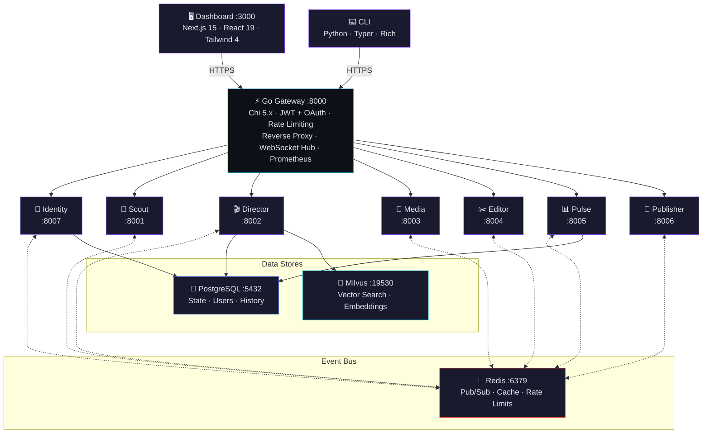
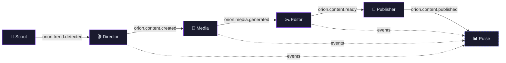

<div align="center">

# ✦ Orion

**Digital Twin Content Agency — from trend to publish, fully autonomous.**

[](https://go.dev)
[](https://python.org)
[](https://nextjs.org)
[](https://fastapi.tiangolo.com)
[](https://postgresql.org)
[](https://redis.io)
[](https://docs.docker.com/compose/)
[](#license)

<br />

A swarm of specialized AI microservices that autonomously detect trends, write scripts, generate media, assemble videos, and publish across social platforms. One Go gateway orchestrates everything. A glassmorphism Next.js dashboard gives operators full visibility and control.

<br />

[Quick Start](#-quick-start) · [Architecture](#-architecture) · [Screenshots](#-screenshots) · [Services](#-services) · [CLI](#-cli) · [Development](#-development) · [Docs](#-documentation)

</div>

<br />

---

<br />

## ✦ Overview

Orion is a **Digital Twin Content Agency** — an end-to-end autonomous content pipeline powered by AI agents. Point it at a niche, and it will:

1. **Detect** trending topics across Google Trends, Twitter/X, RSS, and news APIs
2. **Script** video content using LangGraph agent workflows with vector memory
3. **Generate** images via ComfyUI (local) or Fal.ai (cloud) with batch concurrency
4. **Assemble** videos with TTS narration, auto-captions, and subtitle burning
5. **Publish** to Twitter/X, YouTube, TikTok, and LinkedIn with safety checks

Every stage is a decoupled microservice communicating over Redis pub/sub events. Add, remove, or scale any service independently.

<br />

## ✦ Architecture



### Pipeline Flow

Every arrow below is a **Redis pub/sub event** — services never call each other directly over HTTP.



<br />

## ✦ Screenshots

<table>
<tr>
<td width="50%">
<strong>📊 Dashboard Home</strong><br/>

</td>
<td width="50%">
<strong>🔭 Trend Detection</strong><br/>

</td>
</tr>
<tr>
<td width="50%">
<strong>🎬 Generation Pipeline</strong><br/>

</td>
<td width="50%">
<strong>📈 Analytics & Cost Tracking</strong><br/>

</td>
</tr>
</table>

<br />

## ✦ Quick Start

### Prerequisites

| Tool | Version | Purpose |
|------|---------|---------|
| [Docker](https://docker.com) + [Compose](https://docs.docker.com/compose/) | v2+ | Run the full stack |
| [Go](https://go.dev/dl/) | 1.24+ | Gateway (for local dev) |
| [Python](https://python.org) + [UV](https://docs.astral.sh/uv/) | 3.13+ | Services & CLI (for local dev) |
| [Node.js](https://nodejs.org) | 22 LTS | Dashboard (for local dev) |

### One-Command Start

```bash
# Clone & start
git clone https://github.com/orion-rigel/orion.git
cd orion
cp .env.example .env

# Launch everything
make up

# Open the dashboard
open http://localhost:3001
```

### With GPU Support

```bash
# Includes Ollama (LLM) and ComfyUI (image generation) — requires NVIDIA GPU
make up-full
```

### With Monitoring

```bash
# Adds Prometheus (:9090), Alertmanager (:9093), Grafana (:3003)
make up-monitoring
```

<br />

## ✦ Services

| Service | Port | Language | Description |
|---------|------|----------|-------------|
| **Gateway** | `8000` | Go | Central HTTP gateway — Chi 5.x router, JWT + OAuth authentication (GitHub/Google), per-service rate limiting, reverse proxy, WebSocket hub, Prometheus `/metrics` |
| **Identity** | `8007` | Python | User management — registration, OAuth linking, profile CRUD, token management, RBAC |
| **Scout** | `8001` | Python | Trend detection — Google Trends, RSS, Twitter/X, news APIs. Scores and deduplicates topics, emits `TREND_DETECTED` events |
| **Director** | `8002` | Python | Pipeline orchestrator — LangGraph agent DAGs (Analyst, ScriptGenerator, Critique, VisualPrompter) with PostgreSQL checkpointing and vector memory |
| **Media** | `8003` | Python | Image generation — ComfyUI (local) or Fal.ai (cloud) with batch concurrency control and asset management |
| **Editor** | `8004` | Python | Video assembly — TTS narration, Whisper STT captions, image-to-video stitching, subtitle burning, thumbnail extraction |
| **Pulse** | `8005` | Python | Analytics engine — per-stage latency, success rates, GPU/API cost tracking, 90-day retention with auto-cleanup |
| **Publisher** | `8006` | Python | Social publishing — Twitter/X, YouTube, TikTok, LinkedIn with encrypted credentials, content safety checks, and publish history |
| **Dashboard** | `3000` | TypeScript | Next.js 15 operator UI — content queue, trends explorer, generation progress, system health, provider settings, video preview, analytics |

<br />

## ✦ CLI

Orion ships with a full-featured CLI built on Typer and Rich.

```bash
# Install the CLI
cd cli && uv sync

# Authenticate
uv run orion auth login

# Scout commands — manage trend detection
uv run orion scout list-trends          # View detected trends
uv run orion scout trigger              # Trigger a manual scan
uv run orion scout configure            # Configure sources

# System health
uv run orion system health              # Check all service status
uv run orion system info                # Show system information

# Content management
uv run orion content list               # List generated content
uv run orion pipeline status            # View pipeline status
```

<br />

## ✦ Development

### Project Structure

```
orion/
├── cmd/gateway/              # Go gateway entrypoint
├── internal/gateway/         # Handlers, middleware, proxy, router
├── pkg/                      # Shared Go packages
├── cli/                      # Python CLI (Typer + Rich)
├── services/
│   ├── identity/             # User management & auth
│   ├── scout/                # Trend detection
│   ├── director/             # Pipeline orchestration (LangGraph)
│   ├── media/                # Image generation
│   ├── editor/               # Video assembly + TTS
│   ├── pulse/                # Analytics engine
│   └── publisher/            # Social media publishing
├── libs/orion-common/        # Shared Python library (models, event bus, config)
├── dashboard/                # Next.js admin dashboard
├── deploy/                   # Docker Compose files & configs
├── migrations/               # Alembic database migrations
├── docs/                     # Documentation (Zensical)
└── tests/                    # E2E, benchmark, integration tests
```

### Local Development (No Docker)

```bash
# 1. Install all dependencies
make setup

# 2. Start infrastructure only
docker compose -f deploy/docker-compose.yml up postgres redis milvus -d

# 3. Run the gateway
make run

# 4. Run a Python service (e.g., Scout)
cd services/scout && uv run uvicorn src.main:app --reload --port 8001

# 5. Run the dashboard
cd dashboard && npm install && npm run dev

# 6. Use the CLI
cd cli && uv run orion --help
```

### Build, Test, Lint

<table>
<tr>
<th>Go (Gateway)</th>
<th>Python (Services)</th>
<th>CLI</th>
<th>Dashboard</th>
</tr>
<tr>
<td>

```bash
make build
make run
make test
make lint
```

</td>
<td>

```bash
make py-test
make py-lint
make py-typecheck
make py-format
```

</td>
<td>

```bash
make cli-dev
make cli-test
make cli-lint
make cli-build
```

</td>
<td>

```bash
make dash-dev
make dash-build
make dash-test
make dash-lint
```

</td>
</tr>
</table>

### Run Everything

```bash
make check       # All linters + type checkers across all languages
make test-all    # All tests (Go + Python + CLI + Dashboard)
make test-e2e    # End-to-end tests against Docker stack
make bench       # Performance benchmarks (pytest-benchmark)
make load-test   # Locust load testing (web UI at :8089)
```

<br />

## ✦ Design Principles

| Principle | Implementation |
|-----------|---------------|
| **Event-Driven** | Services communicate exclusively through Redis pub/sub (`orion.*` channels). No direct HTTP between services. |
| **AI-Native, No Vendor Lock-in** | Local-first with Ollama (LLM) and ComfyUI (images). Strategy pattern swaps to cloud providers without code changes. |
| **Single Entry Point** | The Go gateway is the only externally-exposed service — handles auth, rate limiting, proxying, WebSocket broadcast, and metrics. |
| **Repository Pattern** | All data access goes through repository interfaces. Routes call services, services call repositories. |
| **Observable** | Prometheus metrics, structured logging (slog/structlog), health checks on every service, Grafana dashboards. |
| **Multi-Tenant** | Per-user data isolation via `X-User-ID` headers forwarded by the gateway after JWT validation. |

<br />

## ✦ Infrastructure

### Docker Compose Profiles

| Command | What It Starts |
|---------|----------------|
| `make up` | Gateway + all services + PostgreSQL + Redis + Milvus + Dashboard |
| `make up-full` | Everything above + Ollama + ComfyUI (GPU profile) |
| `make up-dev` | Development mode with hot reload |
| `make up-monitoring` | Adds Prometheus, Alertmanager, Grafana |
| `make up-tools` | Adds pgAdmin + Databasus (database tools) |
| `make down` | Stop all containers |
| `make down-clean` | Stop and remove all volumes (fresh start) |

### Infrastructure Components

| Component | Image | Port | Purpose |
|-----------|-------|------|---------|
| PostgreSQL | `postgres:17-alpine` | `5432` | State, users, pipeline history |
| Redis | `redis:7.4-alpine` | `6379` | Pub/sub, cache, rate limits |
| Milvus | `milvusdb/milvus:v2.4.24` | `19530` | Vector search, embeddings |
| Ollama | `ollama/ollama:latest` | `11434` | Local LLM inference |
| ComfyUI | `yanwenkun/comfyui:latest` | `8188` | Local image generation |
| Prometheus | `prom/prometheus:v2.51.0` | `9090` | Metrics collection |
| Grafana | `grafana/grafana:10.4.0` | `3003` | Metrics dashboards |

<br />

## ✦ Tech Stack

<table>
<tr><th>Layer</th><th>Technology</th><th>Version</th></tr>
<tr><td rowspan="2"><strong>Gateway</strong></td><td>Go</td><td>1.24</td></tr>
<tr><td>Chi (router)</td><td>5.x</td></tr>
<tr><td rowspan="2"><strong>CLI</strong></td><td>Python</td><td>3.13</td></tr>
<tr><td>Typer + Rich</td><td>0.15.x</td></tr>
<tr><td rowspan="5"><strong>Services</strong></td><td>Python</td><td>3.13</td></tr>
<tr><td>FastAPI</td><td>0.115.x</td></tr>
<tr><td>Pydantic</td><td>2.10.x</td></tr>
<tr><td>SQLAlchemy</td><td>2.0.x</td></tr>
<tr><td>LangGraph</td><td>1.x</td></tr>
<tr><td rowspan="3"><strong>Dashboard</strong></td><td>Next.js + React 19</td><td>15.2</td></tr>
<tr><td>Tailwind CSS</td><td>4.0</td></tr>
<tr><td>Recharts</td><td>3.8</td></tr>
<tr><td rowspan="3"><strong>Infrastructure</strong></td><td>PostgreSQL</td><td>17</td></tr>
<tr><td>Redis</td><td>7.4</td></tr>
<tr><td>Milvus</td><td>2.4</td></tr>
<tr><td rowspan="2"><strong>AI Models</strong></td><td>Ollama (LLM)</td><td>latest</td></tr>
<tr><td>ComfyUI (Images)</td><td>latest</td></tr>
<tr><td><strong>Package Mgmt</strong></td><td>UV (Python) · npm (Node.js)</td><td>latest</td></tr>
</table>

<br />

## ✦ Documentation

Full documentation is available in the [`docs/`](docs/) directory, served via [Zensical](https://zensical.dev).

```bash
make docs         # Serve docs locally with live reload (:8080)
make docs-build   # Build static documentation site
```

**Key sections:**

- [Architecture Overview](docs/architecture/index.md) — system design, port map, event flow
- [Getting Started](docs/getting-started/installation.md) — installation, configuration, troubleshooting
- [Deployment Guide](docs/deployment/docker.md) — Docker Compose, production, monitoring
- [Service Reference](docs/services/index.md) — per-service API and configuration docs
- [Demo Mode Guide](docs/guides/demo-mode.md) — running the dashboard with sample data

<br />

## ✦ Contributing

1. Fork the repository
2. Create a feature branch (`git checkout -b feat/my-feature`)
3. Follow the commit format: `feat(ORION-{id}): description`
4. Run all checks before pushing: `make check && make test-all`
5. Open a Pull Request

**Commit types:** `feat`, `fix`, `docs`, `refactor`, `test`, `chore`

<br />

## ✦ License

This project is proprietary. All rights reserved.

<br />

---

<div align="center">

**Orion** — Built with Go, Python, and TypeScript.

_Detect trends. Generate content. Publish autonomously._

</div>
