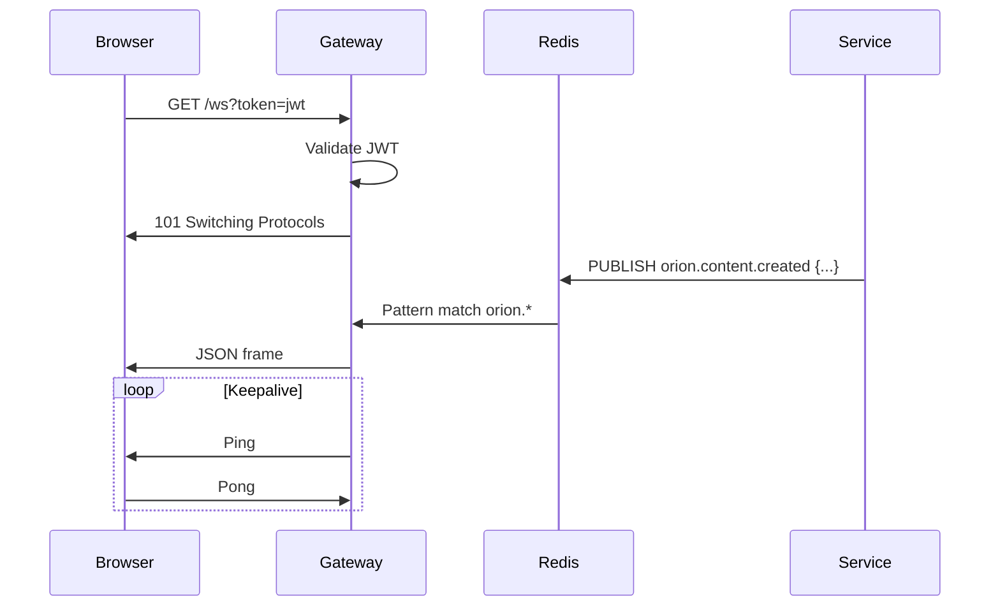

# WebSocket

The gateway provides a WebSocket endpoint for real-time event streaming from the platform.

## :material-connection: Connection

### Endpoint

```
GET /ws?token=<jwt>
```

Authentication is via the `token` query parameter (not the Authorization header, as WebSocket doesn't support custom headers during the upgrade handshake).

### Connecting

=== "JavaScript"

    ```javascript
    const token = "eyJhbGciOiJIUzI1NiIs...";
    const ws = new WebSocket(`ws://localhost:8000/ws?token=${token}`);

    ws.onopen = () => {
      console.log("Connected to Orion");
    };

    ws.onmessage = (event) => {
      const data = JSON.parse(event.data);
      console.log("Event:", data.channel, data.payload);
    };

    ws.onerror = (error) => {
      console.error("WebSocket error:", error);
    };

    ws.onclose = (event) => {
      console.log("Disconnected:", event.code, event.reason);
    };
    ```

=== "Python"

    ```python
    import asyncio
    import json
    import websockets

    async def listen():
        token = "eyJhbGciOiJIUzI1NiIs..."
        uri = f"ws://localhost:8000/ws?token={token}"

        async with websockets.connect(uri) as ws:
            async for message in ws:
                data = json.loads(message)
                print(f"Event: {data['channel']} -> {data['payload']}")

    asyncio.run(listen())
    ```

## :material-message-flash: Message Format

All WebSocket messages are JSON objects with the following structure:

```json
{
  "channel": "orion.trend.detected",
  "payload": {
    "trend_id": "550e8400-e29b-41d4-a716-446655440000",
    "topic": "AI agents in production",
    "source": "google_trends",
    "score": 0.87,
    "niche": "technology"
  },
  "timestamp": "2024-03-12T10:30:00Z"
}
```

## :material-transit-connection: Event Channels

The WebSocket hub subscribes to all Redis channels matching `orion.*`:

| Channel                        | Description               |
| ------------------------------ | ------------------------- |
| `orion.trend.detected`         | New trend detected        |
| `orion.trend.expired`          | Trend expired             |
| `orion.content.created`        | Content generated         |
| `orion.content.updated`        | Content status changed    |
| `orion.content.rejected`       | Content rejected          |
| `orion.content.published`      | Content published         |
| `orion.media.generated`        | Images generated          |
| `orion.media.failed`           | Image generation failed   |
| `orion.pipeline.stage_changed` | Pipeline stage transition |

## :material-cog: Connection Parameters

| Parameter     | Value               |
| ------------- | ------------------- |
| Ping interval | 30 seconds          |
| Read timeout  | 60 seconds          |
| Protocol      | JSON over WebSocket |

## :material-transit-connection-variant: Architecture



!!! note "Connection lifecycle"
The gateway manages a hub of active WebSocket connections. When a client disconnects (or fails to respond to a ping within 60 seconds), the connection is cleaned up. Clients should implement reconnection logic with exponential backoff.
