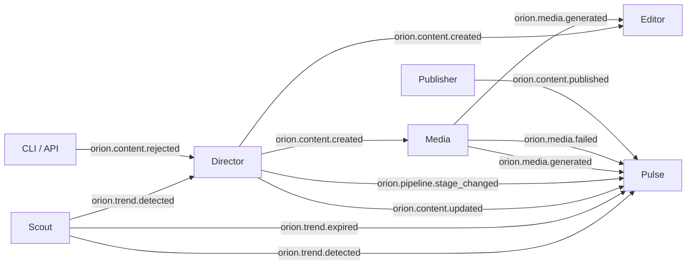
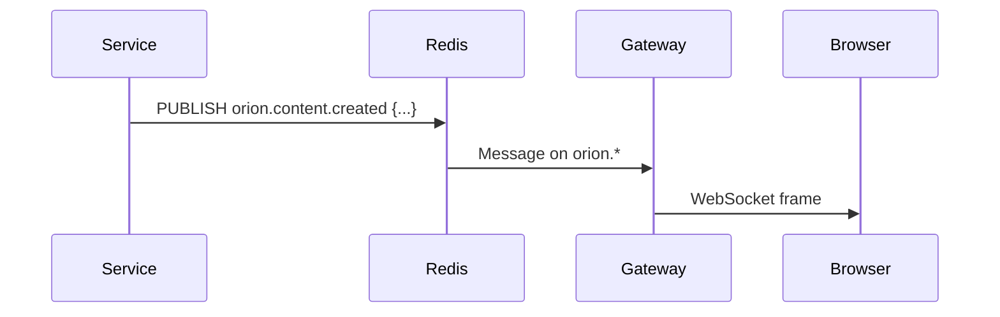

# Communication

All inter-service communication in Orion flows through Redis pub/sub. Services never make direct HTTP calls to each other.

## :material-message-arrow-right: Event Bus

The `EventBus` class in `libs/orion-common/` provides an async Redis pub/sub wrapper:

```python
from orion_common.event_bus import EventBus

bus = EventBus("redis://localhost:6379")

# Subscribe to events
await bus.subscribe("orion.trend.detected", handle_trend)

# Start background listener
await bus.start_listening()

# Publish an event
await bus.publish("orion.trend.detected", {
    "trend_id": "abc-123",
    "topic": "AI agents",
    "source": "google_trends",
    "score": 0.87,
    "niche": "technology",
})
```

## :material-transit-connection: Channel Map



## :material-table: Channel Reference

| Channel                        | Publisher | Subscribers     | Payload                                         |
| ------------------------------ | --------- | --------------- | ----------------------------------------------- |
| `orion.trend.detected`         | Scout     | Director, Pulse | `{trend_id, topic, source, score, niche}`       |
| `orion.trend.expired`          | Scout     | Pulse           | `{trend_id}`                                    |
| `orion.content.created`        | Director  | Media, Editor   | `{content_id, trend_id, title, visual_prompts}` |
| `orion.content.updated`        | Director  | Pulse           | `{content_id, status, stage}`                   |
| `orion.content.rejected`       | CLI/API   | Director        | `{content_id, feedback, action}`                |
| `orion.content.published`      | Publisher | Pulse           | `{content_id, platform, publish_id}`            |
| `orion.media.generated`        | Media     | Editor, Pulse   | `{content_id, asset_ids, provider}`             |
| `orion.media.failed`           | Media     | Pulse           | `{content_id, error}`                           |
| `orion.pipeline.stage_changed` | Director  | Pulse           | `{content_id, stage, timestamp}`                |

## :material-router-wireless: WebSocket Bridge

The gateway's WebSocket hub subscribes to Redis channels matching `orion.*` and broadcasts events to connected browser clients:



- **Endpoint:** `GET /ws?token=<jwt>`
- **Keepalive:** Ping every 30 seconds
- **Read timeout:** 60 seconds

## :material-shield-check: Event Guarantees

!!! note "At-most-once delivery"
Redis pub/sub provides at-most-once delivery. If a subscriber is offline when an event is published, the event is lost. For critical workflows, the Director uses LangGraph checkpointing to persist state and enable recovery.
