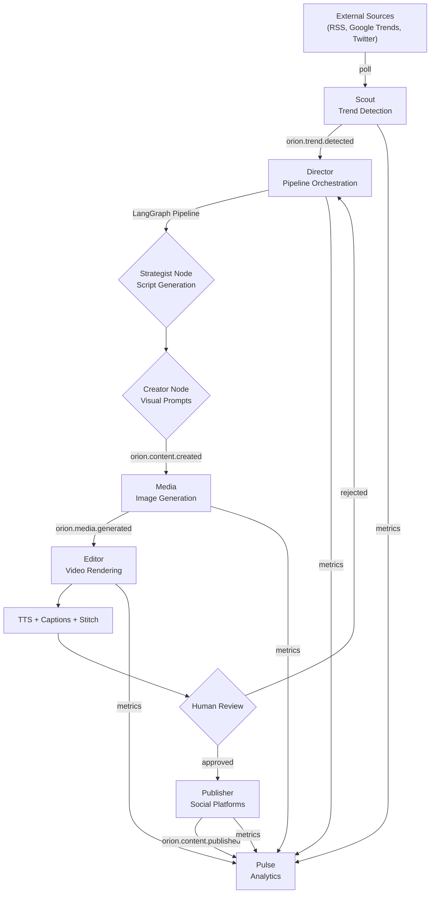

# Data Flow

Orion's content creation pipeline is fully event-driven. Data flows from external trend sources through a series of autonomous processing stages to produce published video content.

## :material-transit-connection-variant: End-to-End Pipeline



## :material-numeric-1-circle: Trend Detection (Scout)

1. Scout polls configured external sources (RSS feeds, Google Trends API, Twitter API)
2. Raw signals are scored using niche-specific keyword matching
3. Trends are deduplicated against existing records in PostgreSQL
4. New trends are persisted with status `active`
5. An `orion.trend.detected` event is published to Redis

**Event payload:**

```json
{
  "trend_id": "550e8400-e29b-41d4-a716-446655440000",
  "topic": "AI agents in production",
  "source": "google_trends",
  "score": 0.87,
  "niche": "technology"
}
```

## :material-numeric-2-circle: Content Generation (Director)

1. Director subscribes to `orion.trend.detected` events
2. A LangGraph `StateGraph` is constructed with the following nodes:
   - **Strategist** -- Generates an H-V-C script (hook, visual body, CTA) and runs self-critique
   - **Creator** -- Extracts visual prompts from the script
   - **Analyst** (optional) -- Analyzes pipeline performance and suggests improvements
3. Each node can have an HITL interrupt gate for human review
4. State is checkpointed to PostgreSQL via `AsyncPostgresSaver`
5. Vector memory (Milvus) provides context from previous content
6. On completion, `orion.content.created` is published

## :material-numeric-3-circle: Image Generation (Media)

1. Media subscribes to `orion.content.created` events
2. Visual prompts from the Director are sent to the image provider
3. Provider chain: ComfyUI (local) with Fal.ai (cloud) fallback
4. Generated images are stored as `media_assets` records
5. `orion.media.generated` event is published

## :material-numeric-4-circle: Video Rendering (Editor)

1. Editor subscribes to `orion.media.generated` events
2. Rendering pipeline:
   - **TTS** -- Text-to-speech from script body (Ollama or cloud provider)
   - **Captions** -- Whisper transcription of audio
   - **Stitch** -- FFmpeg combines images + audio into video
   - **Subtitles** -- Burn captions onto video
   - **Thumbnail** -- Generate video thumbnail
   - **Validate** -- Check output meets platform requirements
3. Default output: 1080x1920 (vertical) for short-form platforms

## :material-numeric-5-circle: Publishing (Publisher)

1. User approves content via CLI or Dashboard
2. Publisher distributes to configured platforms (Twitter/X, YouTube, TikTok, Instagram)
3. `orion.content.published` event is emitted

## :material-numeric-6-circle: Analytics (Pulse)

Pulse subscribes to all event channels and:

- Aggregates content performance metrics
- Tracks AI provider costs (token usage, API calls)
- Maintains pipeline execution history
- Runs daily cleanup (90-day retention)
