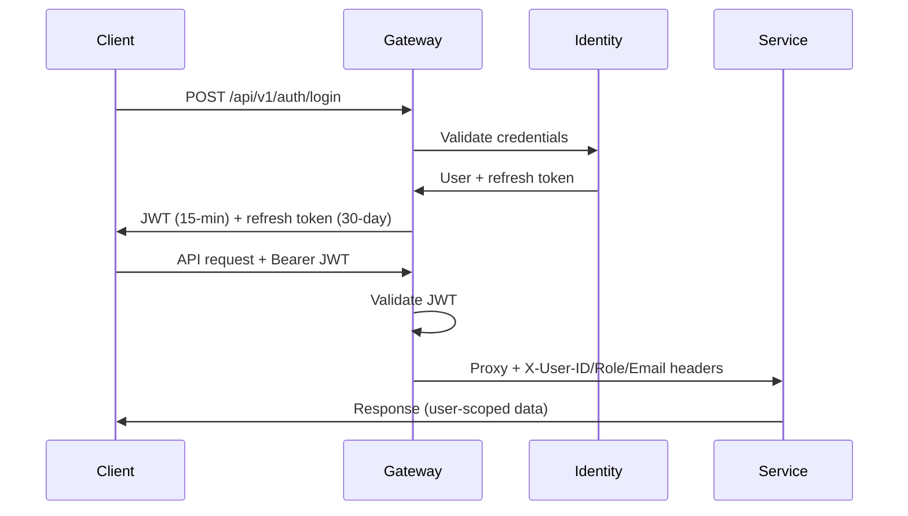

# :lucide-boxes: Architecture

Orion follows a microservices architecture with an event-driven communication model. A Go gateway acts as the single entry point, handling OAuth authentication and JWT validation before routing HTTP requests to seven Python FastAPI services that communicate through Redis pub/sub.

## :material-layers: System Layers

```mermaid
graph LR
    subgraph Clients["Client Layer"]
        CLI["Python CLI"]
        Dash["Next.js Dashboard"]
        WS["WebSocket Clients"]
    end

    subgraph Edge["Edge Layer"]
        GW["Go Gateway\n:8000"]
    end

    subgraph App["Application Layer"]
        SC["Scout"]
        DR["Director"]
        MD["Media"]
        ED["Editor"]
        PL["Pulse"]
        PB["Publisher"]
        ID["Identity"]
    end

    subgraph Infra["Infrastructure Layer"]
        PG[("PostgreSQL")]
        RD[("Redis")]
        MV[("Milvus")]
        OL["Ollama"]
        CU["ComfyUI"]
    end

    Clients --> Edge
    Edge --> App
    App --> Infra
```

## :material-star: Design Principles

| Principle                | Implementation                                               |
| ------------------------ | ------------------------------------------------------------ |
| **Repository Pattern**   | Abstract data access behind interfaces in each service       |
| **Factory Pattern**      | Create providers/clients via factories, not raw constructors |
| **Strategy Pattern**     | Swap LOCAL/CLOUD implementations via strategy interfaces     |
| **Dependency Injection** | Inject dependencies; no singleton imports                    |
| **Observer Pattern**     | Redis pub/sub for cross-service events                       |

## :material-transit-connection: Communication Model

- **External to Platform** -- All traffic enters through the Go gateway on port 8000
- **Service to Service** -- Redis pub/sub events (never direct HTTP between services)
- **Service to Data** -- Direct connections to PostgreSQL, Redis, and Milvus
- **Real-time Updates** -- WebSocket hub in the gateway subscribes to Redis channels

## :material-shield-lock: Authentication

The gateway implements DB-backed multi-user auth with OAuth (GitHub/Google), short-lived JWT access tokens, and refresh token rotation:

See **[Security](security.md)** for full details on OAuth flows, token rotation, and theft detection.

## :material-view-grid: Service Responsibilities

| Service   | Port | Language   | Role                                         |
| --------- | ---- | ---------- | -------------------------------------------- |
| Gateway   | 8000 | Go         | HTTP routing, OAuth, JWT auth, rate limiting, WebSocket |
| Scout     | 8001 | Python     | Trend detection from external sources        |
| Director  | 8002 | Python     | Content pipeline orchestration (LangGraph)   |
| Media     | 8003 | Python     | Image generation (ComfyUI/Fal.ai)            |
| Editor    | 8004 | Python     | Video rendering (TTS, captions, stitching)   |
| Pulse     | 8005 | Python     | Analytics, cost tracking, pipeline history   |
| Publisher | 8006 | Python     | Social media publishing                      |
| Identity  | 8007 | Python     | User management, auth, OAuth linking         |
| Dashboard | 3000 | TypeScript | Admin UI with OAuth login                    |

## :material-book-open-variant: Further Reading

-   :lucide-workflow: **[Data Flow](data-flow.md)**

    ---

    How data moves through the pipeline

-   :lucide-radio: **[Communication](communication.md)**

    ---

    Redis pub/sub event system

-   :lucide-database: **[Database](database.md)**

    ---

    Schema and relationships

-   :lucide-shield: **[Security](security.md)**

    ---

    Authentication and authorization model

