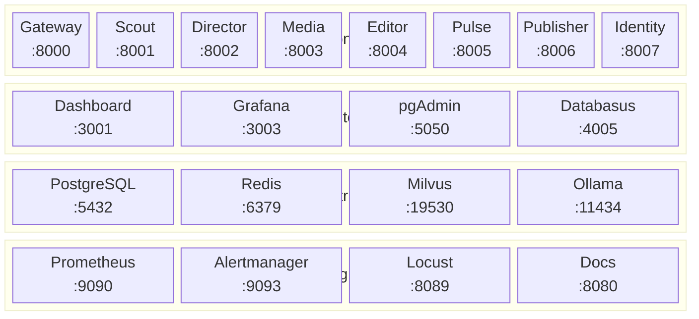

# :lucide-network: Port Map

Complete port assignments for all Orion services, infrastructure, and tools.

!!! info "No port conflicts"
    All ports are unique and non-overlapping across the entire stack.

## :lucide-server: Application Services

| Port | Service | Protocol | Description |
|------|---------|----------|-------------|
| 8000 | Gateway | HTTP | Go API gateway, single entry point |
| 8001 | Scout | HTTP | Trend detection |
| 8002 | Director | HTTP | Pipeline orchestration |
| 8003 | Media | HTTP | Image generation |
| 8004 | Editor | HTTP | Video rendering |
| 8005 | Pulse | HTTP | Analytics |
| 8006 | Publisher | HTTP | Social publishing |
| 8007 | Identity | HTTP | User auth & management |
| 3001 | Dashboard | HTTP | Next.js admin UI |

## :lucide-database: Infrastructure

| Port | Service | Protocol | Description |
|------|---------|----------|-------------|
| 5432 | PostgreSQL | TCP | Primary database |
| 6379 | Redis | TCP | Cache, pub/sub, sessions |
| 19530 | Milvus | gRPC | Vector search |
| 9091 | Milvus | HTTP | Health check API |
| 11434 | Ollama | HTTP | Local LLM inference |
| 8188 | ComfyUI | HTTP/WS | Image generation UI |

## :lucide-wrench: Database Tools

| Port | Service | Protocol | Description |
|------|---------|----------|-------------|
| 5050 | pgAdmin 4 | HTTP | PostgreSQL management UI |
| 4005 | Databasus | HTTP | Automated backup dashboard |

## :lucide-activity: Monitoring

| Port | Service | Protocol | Description |
|------|---------|----------|-------------|
| 9090 | Prometheus | HTTP | Metrics collection |
| 9093 | Alertmanager | HTTP | Alert routing |
| 3003 | Grafana | HTTP | Monitoring dashboards |

## :lucide-test-tube: E2E Test Mocks

| Port | Service | Description |
|------|---------|-------------|
| 9001 | Mock LLM | Test LLM provider |
| 9002 | Mock ComfyUI | Test image provider |
| 9003 | Mock TTS | Test TTS provider |
| 9004 | Mock FAL | Test cloud provider |

## :lucide-code: Development Tools

| Port | Service | Description |
|------|---------|-------------|
| 8080 | Documentation | Zensical docs server |
| 8089 | Locust | Load test web UI |

## :lucide-map: Port Layout Diagram

