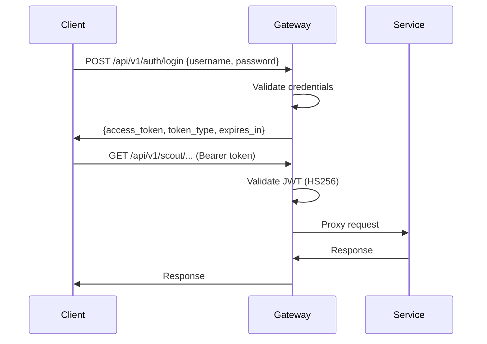

# Security

Orion uses JWT-based authentication with the Go gateway as the single enforcement point.

## :material-shield-lock: Authentication Flow



## :material-key: JWT Configuration

| Property  | Value                                            |
| --------- | ------------------------------------------------ |
| Algorithm | HMAC-SHA256 (HS256)                              |
| Expiry    | 24 hours                                         |
| Claims    | `sub`, `username`, `email`, `role`, `iat`, `exp` |
| Header    | `Authorization: Bearer <token>`                  |

**Token payload structure:**

```json
{
  "sub": "user-uuid",
  "username": "admin",
  "email": "admin@orion.local",
  "role": "admin",
  "iat": 1710000000,
  "exp": 1710086400
}
```

## :material-lock: Protected vs Public Endpoints

### Public (no authentication required)

| Endpoint                    | Purpose            |
| --------------------------- | ------------------ |
| `GET /health`               | Liveness probe     |
| `GET /ready`                | Readiness probe    |
| `GET /metrics`              | Prometheus metrics |
| `POST /api/v1/auth/login`   | Authentication     |
| `POST /api/v1/auth/refresh` | Token refresh      |

### Protected (JWT required)

All endpoints under `/api/v1/{service}/*` require a valid Bearer token.

## :material-shield-half-full: Middleware Chain

The gateway applies middleware in this order:

1. **RequestID** -- Generates/propagates `X-Request-ID` header
2. **Logger** -- Structured request logging
3. **Recoverer** -- Panic recovery with stack traces
4. **CORS** -- Cross-origin resource sharing
5. **Metrics** -- Prometheus instrumentation
6. **Auth** -- JWT validation (protected routes only)
7. **RateLimit** -- Per-service sliding window rate limiting

## :material-rate-limit: Rate Limiting

Redis-backed sliding window rate limiter with per-service, per-user limits:

| Service   | Read Limit  | Write Limit |
| --------- | ----------- | ----------- |
| Director  | 100 req/min | 20 req/min  |
| Scout     | 10 req/min  | --          |
| Pulse     | 60 req/min  | --          |
| Media     | 60 req/min  | --          |
| Editor    | 60 req/min  | --          |
| Publisher | 60 req/min  | --          |

Rate limit response headers:

- `X-RateLimit-Limit`
- `X-RateLimit-Remaining`
- `X-RateLimit-Reset`
- `Retry-After` (on 429 Too Many Requests)

## :material-network: Network Security

- All inter-service traffic flows over the `orion-net` Docker bridge network
- Services are not directly exposed to the host -- only the gateway and dashboard bind to host ports
- WebSocket connections require JWT authentication via query parameter (`?token=<jwt>`)

!!! danger "Production Checklist" - Change `ORION_JWT_SECRET` from the default value - Restrict CORS origins (default allows all) - Enable TLS termination at the gateway or load balancer - Use strong admin credentials - Rotate JWT secrets periodically
