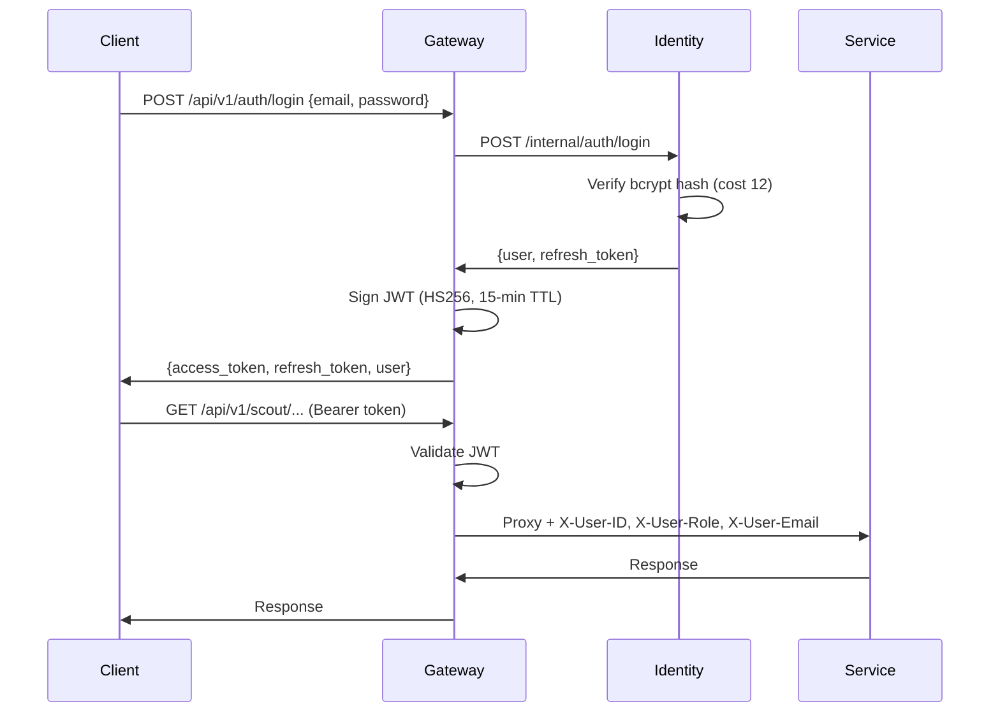
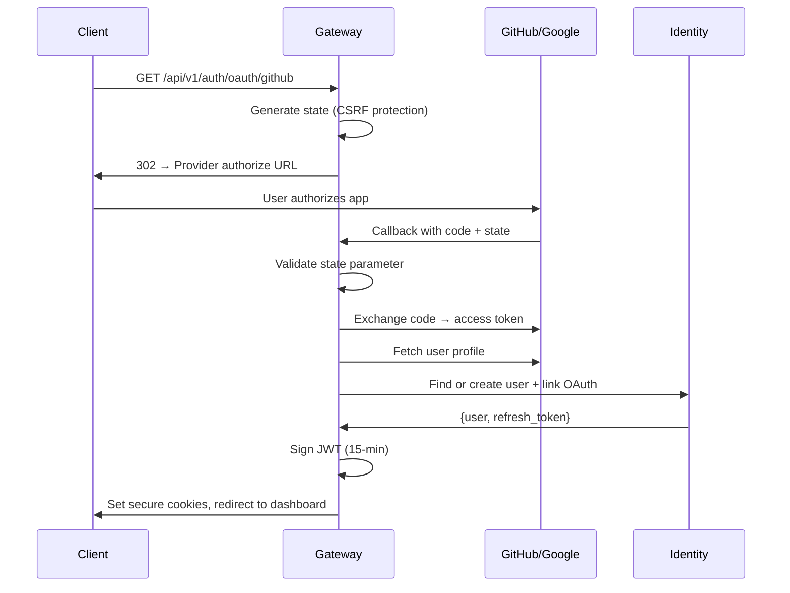

# :lucide-shield: Security

Orion uses DB-backed multi-user authentication with the Go gateway as the single enforcement point. The Identity service manages user accounts and tokens, while the gateway handles OAuth flows, JWT signing, and header forwarding.

## :material-shield-lock: Authentication Flow

### Email/Password



### OAuth 2.0 (GitHub / Google)



## :material-key: JWT Configuration

| Property       | Value                                       |
| -------------- | ------------------------------------------- |
| Algorithm      | HMAC-SHA256 (HS256)                         |
| Access expiry  | 15 minutes                                  |
| Refresh expiry | 30 days                                     |
| Claims         | `sub`, `email`, `name`, `role`, `iat`, `exp`|
| Header         | `Authorization: Bearer <token>`             |

**Access token payload:**

```json
{
  "sub": "user-uuid",
  "email": "admin@orion.local",
  "name": "Admin",
  "role": "admin",
  "iat": 1710000000,
  "exp": 1710000900
}
```

## :material-arrow-right-bold: User Header Forwarding

After JWT validation, the gateway injects user context headers into all proxied requests:

| Header         | Source           | Description                              |
| -------------- | ---------------- | ---------------------------------------- |
| `X-User-ID`    | JWT `sub` claim  | User UUID, used for per-user data isolation |
| `X-User-Role`  | JWT `role` claim | User role (`admin`, `user`)              |
| `X-User-Email` | JWT `email` claim| User email address                       |

Downstream services extract these headers via `get_current_user()` to scope all database queries to the authenticated user.

## :material-lock: Password Security

- **Hashing algorithm** — bcrypt with cost factor 12
- **Minimum password length** — Enforced at registration and password change
- **Reset tokens** — Short-lived, single-use, sent via email
- **No plaintext storage** — Passwords are never stored or logged in plaintext

## :material-rotate-right: Refresh Token Security

| Property           | Implementation                                                    |
| ------------------ | ----------------------------------------------------------------- |
| Format             | Opaque string (`ort_` prefix)                                    |
| Storage            | DB-backed in Identity service                                    |
| Lifetime           | 30 days                                                          |
| Rotation           | New token issued on each refresh, old token revoked              |
| Family tracking    | Tokens belong to a family; reuse of revoked token invalidates family |
| Theft detection    | Revoked token reuse triggers full family revocation              |

## :material-shield-half-full: OAuth Security

- **State parameter** — Random, unguessable state value for CSRF protection on OAuth initiate
- **State validation** — Callback verifies state matches the value sent during initiation
- **Secure cookies** — OAuth tokens set with `HttpOnly`, `Secure`, `SameSite=Lax`
- **Account linking** — OAuth accounts are linked to Orion users by provider + provider user ID

## :material-lock: Protected vs Public Endpoints

### Public (no authentication required)

| Endpoint                                 | Purpose                |
| ---------------------------------------- | ---------------------- |
| `GET /health`                            | Liveness probe         |
| `GET /ready`                             | Readiness probe        |
| `GET /metrics`                           | Prometheus metrics     |
| `POST /api/v1/auth/login`               | Email/password login   |
| `POST /api/v1/auth/register`            | User registration      |
| `POST /api/v1/auth/refresh`             | Token refresh          |
| `POST /api/v1/auth/forgot-password`     | Password reset request |
| `POST /api/v1/auth/reset-password`      | Password reset         |
| `POST /api/v1/auth/verify-email`        | Email verification     |
| `GET /api/v1/auth/oauth/github`         | GitHub OAuth initiate  |
| `GET /api/v1/auth/oauth/github/callback`| GitHub OAuth callback  |
| `GET /api/v1/auth/oauth/google`         | Google OAuth initiate  |
| `GET /api/v1/auth/oauth/google/callback`| Google OAuth callback  |

### Protected (JWT required)

All endpoints under `/api/v1/{service}/*` require a valid Bearer token.

### Admin-only

Endpoints under `/api/v1/identity/users` (except `/me`) require the `admin` role.

## :material-shield-half-full: Middleware Chain

The gateway applies middleware in this order:

1. **RequestID** -- Generates/propagates `X-Request-ID` header
2. **Logger** -- Structured request logging
3. **Recoverer** -- Panic recovery with stack traces
4. **CORS** -- Cross-origin resource sharing
5. **Metrics** -- Prometheus instrumentation
6. **Auth** -- JWT validation and user header injection (protected routes only)
7. **RateLimit** -- Per-service sliding window rate limiting

## :material-rate-limit: Rate Limiting

Redis-backed sliding window rate limiter with per-service, per-user limits:

| Service   | Read Limit  | Write Limit |
| --------- | ----------- | ----------- |
| Director  | 100 req/min | 20 req/min  |
| Scout     | 10 req/min  | --          |
| Pulse     | 60 req/min  | --          |
| Media     | 60 req/min  | --          |
| Editor    | 60 req/min  | --          |
| Publisher | 60 req/min  | --          |
| Identity  | 60 req/min  | --          |

Auth endpoints (`/api/v1/auth/*`) have stricter rate limits to prevent brute-force attacks.

Rate limit response headers:

- `X-RateLimit-Limit`
- `X-RateLimit-Remaining`
- `X-RateLimit-Reset`
- `Retry-After` (on 429 Too Many Requests)

## :material-network: Network Security

- All inter-service traffic flows over the `orion-net` Docker bridge network
- Services are not directly exposed to the host -- only the gateway and dashboard bind to host ports
- The Identity service is only called internally by the gateway (not exposed via proxy for `/internal/*` routes)
- WebSocket connections require JWT authentication via query parameter (`?token=<jwt>`)

## :material-cookie: Secure Cookie Settings

OAuth callbacks set tokens in cookies with the following attributes:

| Attribute  | Value        | Purpose                              |
| ---------- | ------------ | ------------------------------------ |
| `HttpOnly` | `true`       | Prevent JavaScript access            |
| `Secure`   | `true` (prod)| HTTPS-only in production             |
| `SameSite` | `Lax`        | CSRF protection while allowing OAuth |
| `Path`     | `/`          | Available to all routes              |

!!! danger "Production Checklist"
    - Change `ORION_JWT_SECRET` from the default value
    - Set `OAUTH_REDIRECT_BASE` to your production HTTPS URL
    - Configure real SMTP credentials for transactional emails
    - Restrict CORS origins (default allows all)
    - Enable TLS termination at the gateway or load balancer
    - Rotate JWT secrets periodically
    - Store OAuth client secrets in a vault or sealed secrets
