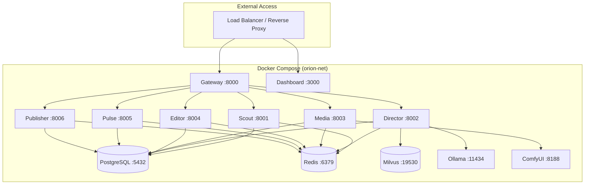

# Deployment

Orion is designed for containerized deployment using Docker Compose, with support for development, staging, and production environments.

## :material-view-grid: Deployment Options

| Environment | Command                                                                           | Description                |
| ----------- | --------------------------------------------------------------------------------- | -------------------------- |
| **Default** | `docker compose -f deploy/docker-compose.yml up`                                  | Core services only         |
| **Full**    | `docker compose -f deploy/docker-compose.yml --profile full up`                   | Includes Ollama & ComfyUI  |
| **GPU**     | `docker compose -f deploy/docker-compose.yml --profile gpu up`                    | GPU-accelerated inference  |
| **Dev**     | `docker compose -f deploy/docker-compose.yml -f deploy/docker-compose.dev.yml up` | Hot reload for development |

## :material-layers: Service Architecture

## :material-book-open-variant: Sections

- [Docker](docker.md) -- Docker Compose configuration and service details
- [Production](production.md) -- Production deployment checklist
- [Monitoring](monitoring.md) -- Prometheus, Grafana, and alerting setup
- [CI/CD](ci-cd.md) -- GitHub Actions workflows
