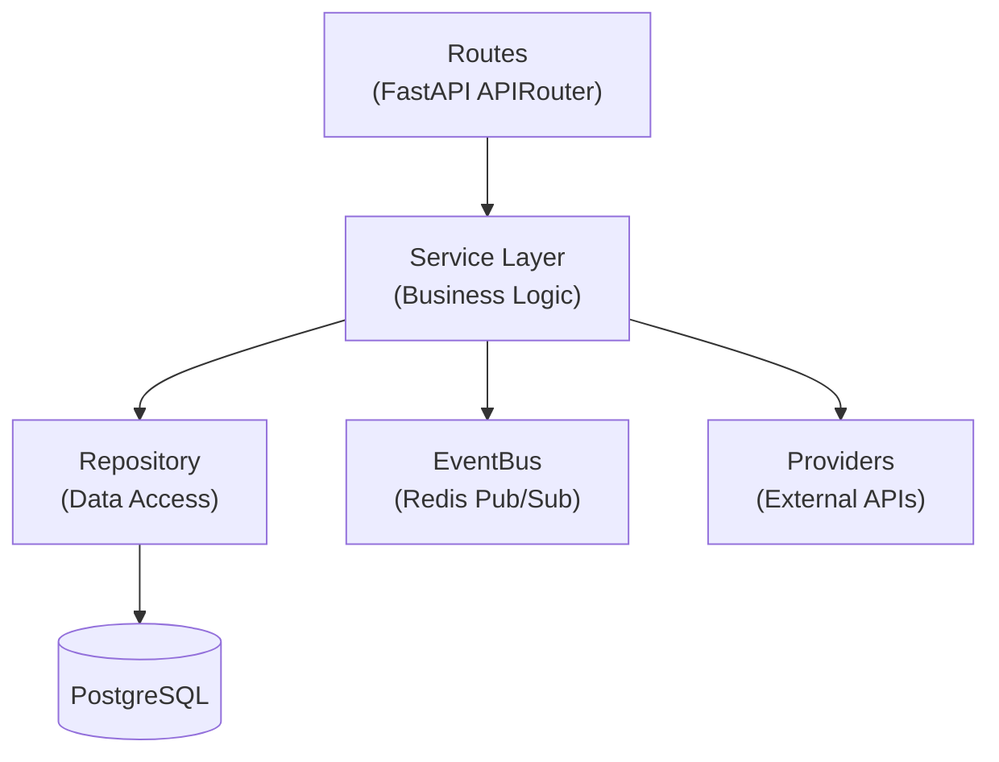

# Project Structure

Orion is a monorepo containing Go services, Python microservices, a Next.js dashboard, and shared libraries.

## :material-folder-open: Repository Layout

```
orion/
  cmd/
    gateway/              # Go HTTP gateway entry point
      main.go
    cli/                  # Go CLI entry point
      main.go
  internal/
    gateway/              # Gateway internals (not importable externally)
      router/             # Chi router setup, route definitions
      middleware/          # Auth, CORS, logging, rate limiting, metrics
      handler/            # Auth handlers, WebSocket hub
      proxy/              # Reverse proxy to Python services
  pkg/
    config/               # Shared Go configuration
  services/
    scout/                # Trend detection service (:8001)
      src/
        main.py           # FastAPI app entry point
        routes/           # API route handlers
        service/          # Business logic layer
        repository/       # Data access layer
        providers/        # External source providers
      tests/              # pytest tests
      pyproject.toml
    director/             # Pipeline orchestration (:8002)
      src/
        main.py
        routes/
        service/
        graph/            # LangGraph pipeline
          state.py        # OrionState TypedDict
          nodes.py        # Node functions
          edges.py        # Conditional routing
          hitl.py         # HITL interrupt helpers
          builder.py      # Graph factory
        agents/           # AI agents
          script_generator.py
          critique_agent.py
          visual_prompter.py
          analyst.py
      tests/
    media/                # Image generation (:8003)
      src/
        main.py
        routes/
        service/
        providers/        # ComfyUI, Fal.ai providers
      tests/
    editor/               # Video rendering (:8004)
      src/
        main.py
        routes/
        service/
        pipeline/         # TTS, captions, stitcher, subtitles
      tests/
    pulse/                # Analytics (:8005)
      src/
        main.py
        routes/
        service/
        aggregator/       # Event aggregation
      tests/
    publisher/            # Social publishing (:8006)
      src/
        main.py
        routes/
        service/
      tests/
  libs/
    orion-common/         # Shared Python library
      orion_common/
        config.py         # CommonSettings (Pydantic BaseSettings)
        db/
          models.py       # SQLAlchemy models, enums
          session.py      # Async session factory
        events.py         # Event channel constants
        event_bus.py      # Redis pub/sub EventBus
        logging.py        # structlog configuration
  dashboard/              # Next.js admin dashboard (:3000)
    src/
      app/                # App Router pages
      components/         # React components
      lib/                # Utilities, API client
    package.json
    tsconfig.json
  deploy/
    docker-compose.yml    # Main compose file
    docker-compose.dev.yml # Dev overrides
    prometheus.yml        # Prometheus config
    grafana/              # Grafana provisioning
  migrations/             # Alembic migrations
    alembic.ini
    env.py
    versions/             # Migration scripts
  docs/
    TECH_STACK.md         # Version inventory
  .github/
    workflows/
      ci.yml              # CI pipeline
      build.yml           # Build pipeline
  Makefile                # Go build targets
  .env.example            # Environment template
```

## :material-layers: Layer Architecture

Each Python service follows the same layered architecture:



| Layer          | Responsibility                    | Example                      |
| -------------- | --------------------------------- | ---------------------------- |
| **Routes**     | HTTP request handling, validation | `routes/trends.py`           |
| **Service**    | Business logic, orchestration     | `service/trend_service.py`   |
| **Repository** | Database queries, data access     | `repository/trend_repo.py`   |
| **Providers**  | External API integration          | `providers/google_trends.py` |
