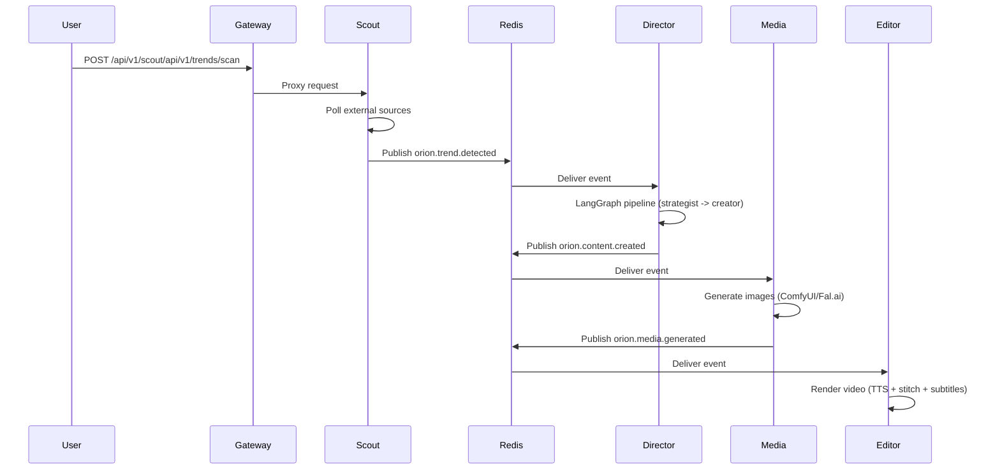

# Quickstart

Get Orion running and trigger your first content pipeline in under 5 minutes. This guide walks you through the complete flow — from starting the platform to generating and approving content.

## :material-numeric-1-circle: Start the Platform

```bash
cp .env.example .env
docker compose -f deploy/docker-compose.yml up -d
```

Wait for all services to become healthy:

```bash
# Watch container health status
docker compose -f deploy/docker-compose.yml ps

# Or check through the CLI
cd cli && uv run orion system health
```

!!! info "Startup time"
    Allow up to 90 seconds for all health checks to pass. PostgreSQL and Milvus initialize their data directories on first run.

!!! tip "Database Management"
    Start pgAdmin and Databasus with `make up-tools`:

    - **pgAdmin:** http://localhost:5050 — browse tables, run queries
    - **Databasus:** http://localhost:4005 — configure automated backups

## :material-numeric-2-circle: Authenticate

You need a JWT token to interact with the API. The default development credentials are `admin` / `orion_dev`.

=== "CLI"

    ```bash
    orion auth login
    # Email: admin@orion.local
    # Password: orion_dev
    ```

    Verify your session:

    ```bash
    orion auth whoami
    ```

=== "curl"

    ```bash
    TOKEN=$(curl -s http://localhost:8000/api/v1/auth/login \
      -H "Content-Type: application/json" \
      -d '{"email": "admin@orion.local", "password": "orion_dev"}' \
      | jq -r '.access_token')

    echo $TOKEN
    ```

=== "Python"

    ```python
    import httpx

    resp = httpx.post(
        "http://localhost:8000/api/v1/auth/login",
        json={"email": "admin@orion.local", "password": "orion_dev"},
    )
    token = resp.json()["access_token"]
    print(f"Token: {token[:20]}...")
    ```

## :material-numeric-3-circle: Trigger a Trend Scan

Kick off the Scout service to detect trending topics from external sources.

=== "CLI"

    ```bash
    # Trigger a trend scan
    orion scout trigger
    ```

=== "curl"

    ```bash
    curl -X POST http://localhost:8000/api/v1/scout/api/v1/trends/scan \
      -H "Authorization: Bearer $TOKEN" \
      -H "Content-Type: application/json" \
      -d '{"region": "US", "limit": 10}'
    ```

=== "Python"

    ```python
    resp = httpx.post(
        "http://localhost:8000/api/v1/scout/api/v1/trends/scan",
        headers={"Authorization": f"Bearer {token}"},
        json={"region": "US", "limit": 10},
    )
    print(resp.json())
    # {"message": "Scan complete", "trends_found": 10, "trends_saved": 7}
    ```

## :material-numeric-4-circle: View Detected Trends

After a scan completes, Scout publishes `orion.trend.detected` events to Redis. You can query the results immediately.

=== "CLI"

    ```bash
    # List detected trends
    orion scout list-trends

    # List trends in JSON format
    orion scout list-trends --format json
    ```

=== "curl"

    ```bash
    curl http://localhost:8000/api/v1/scout/api/v1/trends \
      -H "Authorization: Bearer $TOKEN"
    ```

## :material-numeric-5-circle: Generate Content

When Scout detects a trend, the Director service automatically picks it up via Redis pub/sub and starts a LangGraph pipeline. You can also trigger content generation manually.

=== "CLI"

    ```bash
    # List all content items
    orion content list

    # List content in JSON format
    orion content list --format json
    ```

=== "curl"

    ```bash
    curl -X POST http://localhost:8000/api/v1/director/api/v1/content/generate \
      -H "Authorization: Bearer $TOKEN" \
      -H "Content-Type: application/json" \
      -d '{
        "trend_id": "<trend-uuid>",
        "trend_topic": "AI agents in production",
        "niche": "technology",
        "target_platform": "youtube_shorts"
      }'
    ```

## :material-numeric-6-circle: Review, Approve, and Publish

Content goes through a human-in-the-loop review stage before publishing.

```bash
# List all content items
orion content list

# View full details of a content item (script, assets, metadata)
orion content view <content-id>

# Approve content for publishing
orion content approve <content-id>

# Reject content
orion content reject <content-id>

# Request regeneration
orion content regenerate <content-id>

# Check final publish status
orion content view <content-id>
```

---

## :material-information: What Happens Behind the Scenes

When you trigger a scan, the following event-driven pipeline executes automatically:



Each service communicates exclusively through Redis pub/sub — there are no direct HTTP calls between Python services. This decoupled architecture means any service can be restarted or scaled independently without affecting the pipeline.

---

## :material-arrow-right: Next Steps

- **[Configuration](configuration.md)** — Tune environment variables, rate limits, and AI providers
- **[CLI Reference](../services/cli.md)** — Full list of all CLI commands and flags
- **[API Endpoints](../api/endpoints.md)** — REST API documentation for programmatic access
- **[LangGraph Pipeline](../langgraph/index.md)** — Understand the content creation graph
- **[Docker Deployment](../deployment/docker.md)** — Production deployment and scaling

---

!!! tip ":lucide-book-open: Explore Further"
    - **[Demo Mode](../guides/demo-mode.md)** — Run the dashboard without backend services using demo data
    - **[Full Pipeline Demo](../guides/demo-full-pipeline.md)** — Walk through the complete content pipeline end-to-end
    - **[Dashboard Tour](../guides/dashboard-overview.md)** — Visual tour of every dashboard page
