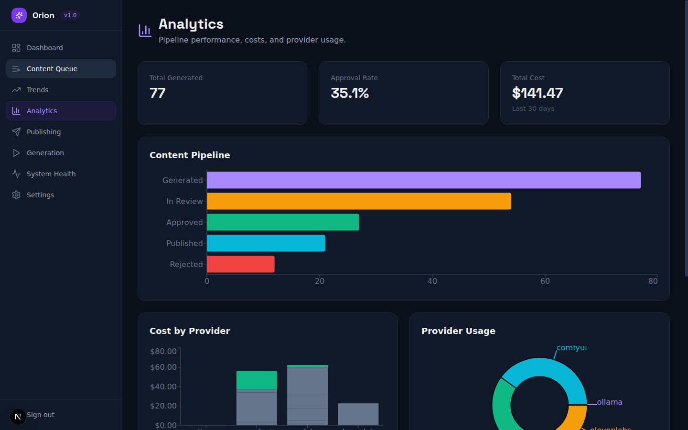
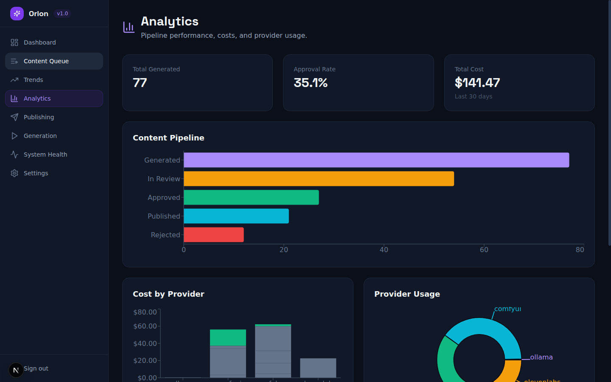

# :lucide-bar-chart-3: Analytics Guide

How to read the Analytics dashboard and understand pipeline performance, costs, and provider usage.

---

## :lucide-eye: Overview

Navigate to **Analytics** from the sidebar. The page provides a comprehensive view of your content pipeline performance.

!!! info "Data Refresh Interval"
    Analytics data refreshes automatically every **60 seconds**. KPI cards and charts pull the latest data from the Pulse service. For immediate updates, reload the page manually.

---

## :lucide-gauge: KPI Cards

Three key performance indicators are displayed at the top:

| KPI | What It Measures |
| --- | --- |
| **Total Generated** | Total number of content items that have been generated |
| **Approval Rate** | Percentage of generated content that was approved (approved / total generated) |
| **Total Cost** | Cumulative cost of all AI provider calls over the last 30 days |

---

## :lucide-git-branch: Content Pipeline

The horizontal bar chart shows how content is distributed across pipeline stages:

- **Generated** -- Total items that entered the pipeline
- **In Review** -- Items currently waiting for human review
- **Approved** -- Items that passed review
- **Published** -- Items published to platforms
- **Rejected** -- Items that failed review

This chart helps you identify bottlenecks. For example, if "In Review" is much larger than "Approved," you may need more reviewers or adjusted quality thresholds.

---

## :lucide-dollar-sign: Cost by Provider

The bar chart breaks down costs by AI provider. Each bar represents a provider (e.g., Ollama, ComfyUI, OpenAI, ElevenLabs) and shows how much has been spent on that provider's API calls.

Use this to:

- Compare cost efficiency between local and cloud providers
- Identify which providers are consuming the most budget
- Decide when to switch between local and cloud providers

!!! tip "Cost Optimization"
    Switch high-volume workloads (like image generation) to **local providers** to reduce cloud API costs. Reserve cloud providers for tasks where quality matters most (e.g., final LLM review passes). Monitor the Cost by Provider chart weekly to catch unexpected spend increases early.

---

## :lucide-pie-chart: Provider Usage

The donut chart shows the proportion of API calls made to each provider. This helps you understand your provider mix and verify that traffic is being routed as expected.

---

## :lucide-alert-triangle: Error Trends

The line chart at the bottom tracks errors over the last 7 days. Spikes in errors may indicate:

- Provider outages or rate limiting
- Configuration issues after a provider change
- Infrastructure problems (GPU out of memory, service crashes)

---

## :lucide-arrow-right: Next Steps

- **[System Administration](system-admin.md)** -- Monitor service health and configure providers
- **[Content Workflow](content-workflow.md)** -- Manage content through the pipeline
- **[Dashboard Overview](dashboard-overview.md)** -- Tour of all dashboard pages
- **[Trend Monitoring](trend-monitoring.md)** -- Understand how trends feed into the pipeline
- **[Provider Setup](demo-provider-setup.md)** -- Configure AI providers for cost control
