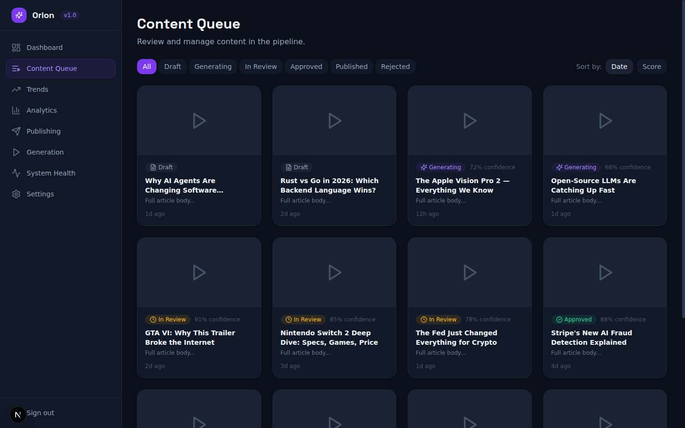
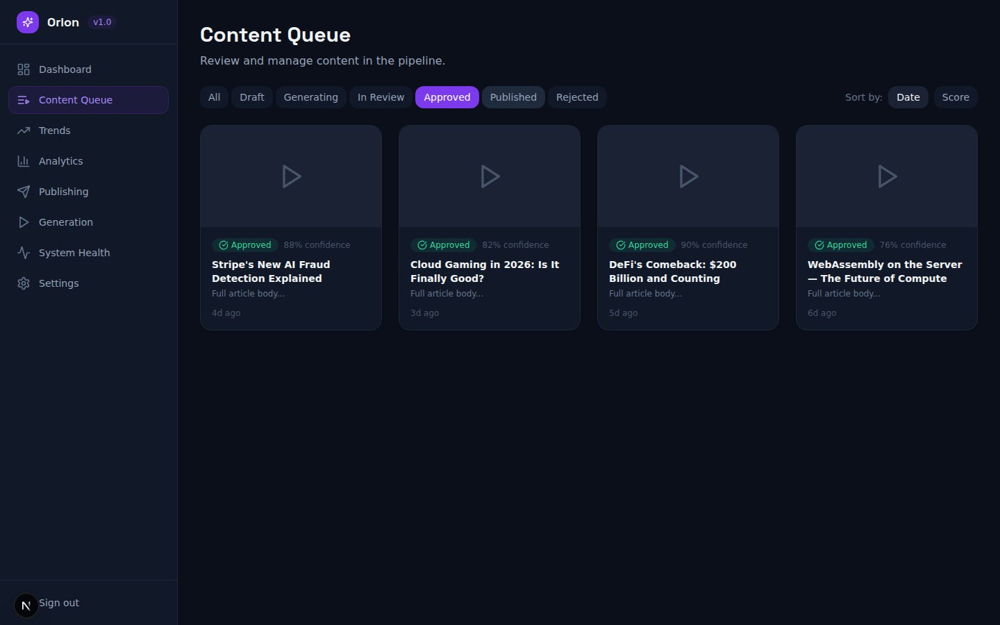
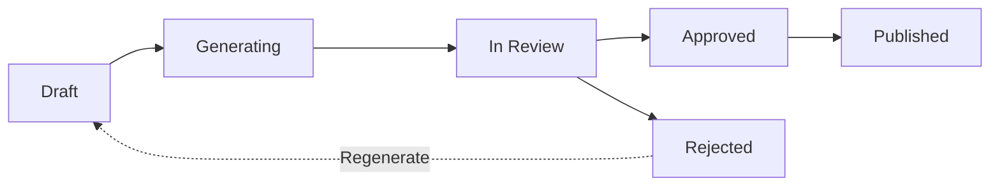

# :lucide-git-branch: Content Workflow

How to manage content as it moves through the Orion pipeline -- from initial generation through review and publishing.

!!! tip "Best Practice"
    Review content promptly when it reaches the **In Review** stage. Letting items sit in review too long can delay your publishing schedule and reduce trend relevance.

---

## :lucide-list: Viewing the Content Queue

Navigate to **Content Queue** from the sidebar. All content items are displayed as cards organized in a grid layout.

Each card shows:

- **Thumbnail** -- Preview of the generated media
- **Status badge** -- Current pipeline stage (Draft, Generating, In Review, Approved, Published, Rejected)
- **Confidence score** -- AI-assigned quality score (shown for items past the Draft stage)
- **Title** -- Content headline
- **Body preview** -- First line of the content body
- **Timestamp** -- When the content was created or last updated

---

## :lucide-filter: Filtering by Status

Use the filter tabs at the top of the Content Queue to narrow down items by their pipeline status.

Available filters:

| Filter | What It Shows |
| --- | --- |
| All | Every content item across all statuses |
| Draft | Newly created content not yet submitted for generation |
| Generating | Content currently being processed by AI services |
| In Review | Generated content awaiting human review |
| Approved | Content that passed review and is ready to publish |
| Published | Content that has been published to one or more platforms |
| Rejected | Content that was rejected during review |

Click any filter tab to instantly update the view. The active filter is highlighted with a colored border.

---

## :lucide-arrow-up-down: Sorting Content

Use the **Sort by** controls in the top-right corner:

- **Date** -- Most recent first (default)
- **Score** -- Highest confidence score first

---

## :lucide-workflow: Content Pipeline Stages

Content moves through these stages in order:

### :lucide-file-edit: Draft

The initial state when a trend has been selected for content creation. The content brief exists but generation has not started.

### :lucide-loader: Generating

The AI pipeline is actively creating content. You can monitor progress on the **Generation** page, which shows each sub-stage (Research, Script, Critique, Images, Video, Render).

### :lucide-eye: In Review

Generation is complete and the content is waiting for human review. Open the content detail view to:

- Read the full script
- Preview generated images and video
- Check the confidence score
- **Approve** or **Reject** the content

!!! tip "Review Checklist"
    Before approving content, check: (1) the script tone matches your brand, (2) generated images are relevant and high-quality, (3) the video renders correctly with audio, and (4) the confidence score is above your threshold.

### :lucide-check-circle: Approved

Content has passed review and is queued for publishing. Navigate to **Publishing** to see scheduled and completed publish jobs.

### :lucide-globe: Published

Content has been successfully published to one or more platforms. The Publishing History table shows the platform, post ID, and publish timestamp.

### :lucide-x-circle: Rejected

Content that did not meet quality standards. Rejected content can be sent back for regeneration.

---

## :lucide-chevrons-left-right: Pagination

When there are more items than fit on one page, pagination controls appear at the bottom of the content grid. Click a page number to navigate.

---

## :lucide-arrow-right: Next Steps

- **[Trend Monitoring](trend-monitoring.md)** -- See where content ideas come from
- **[Analytics Guide](analytics-guide.md)** -- Track content performance and costs
- **[Dashboard Overview](dashboard-overview.md)** -- Tour of all dashboard pages
- **[CLI Quickstart](cli-quickstart.md)** -- Manage content from the command line
- **[Full Pipeline Demo](demo-full-pipeline.md)** -- End-to-end walkthrough of the entire pipeline
