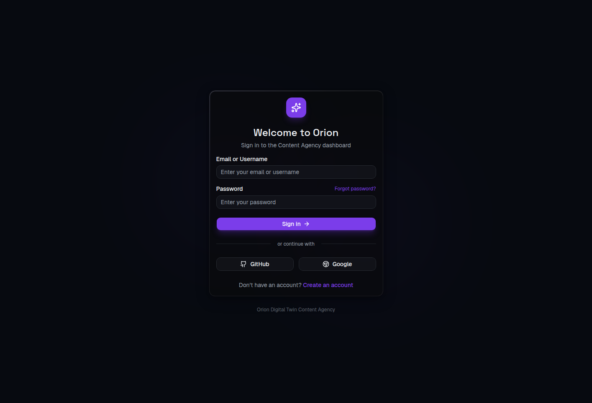
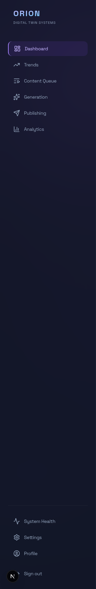
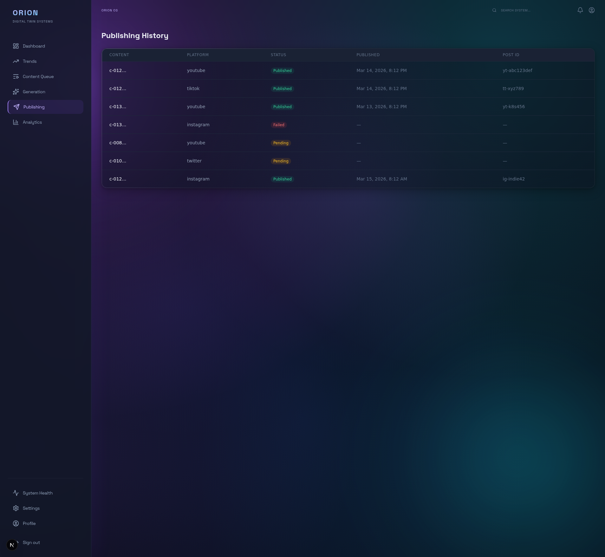
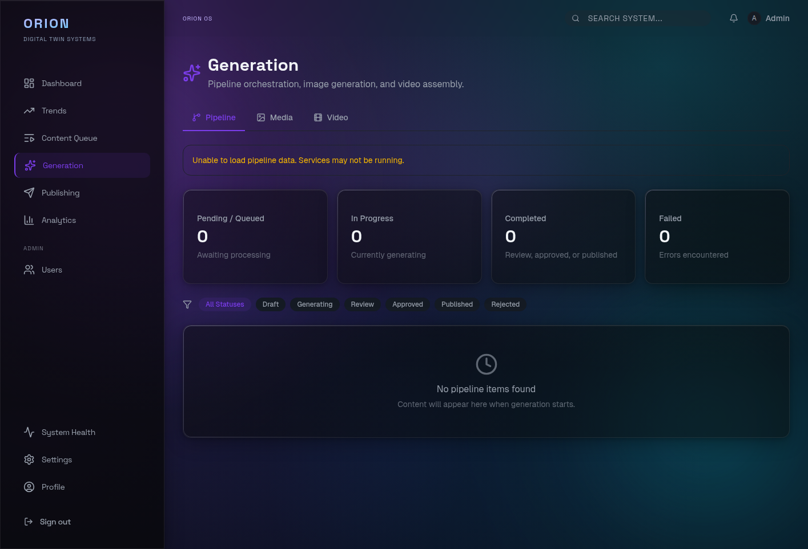
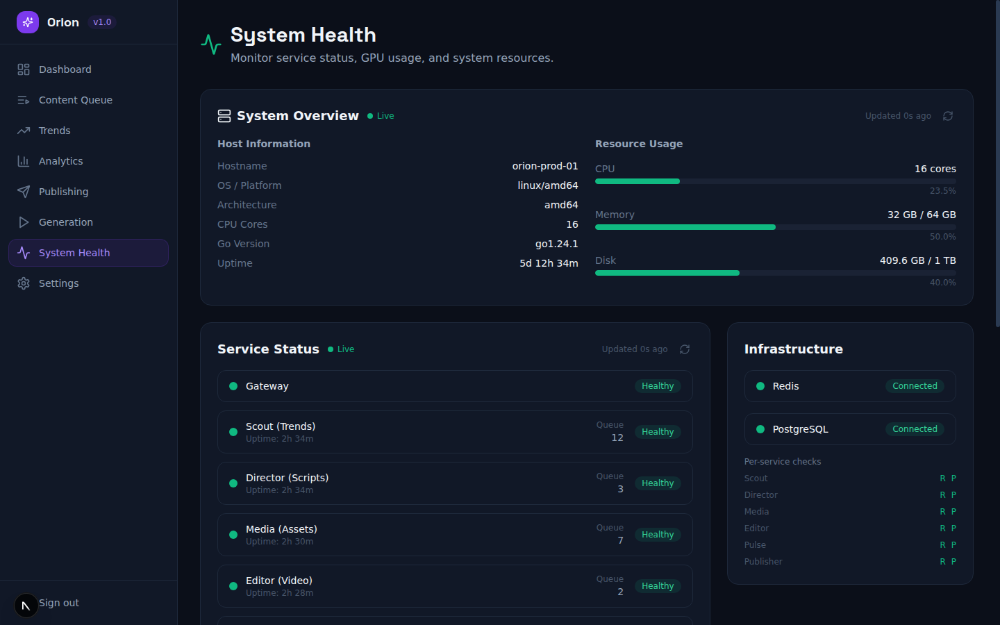
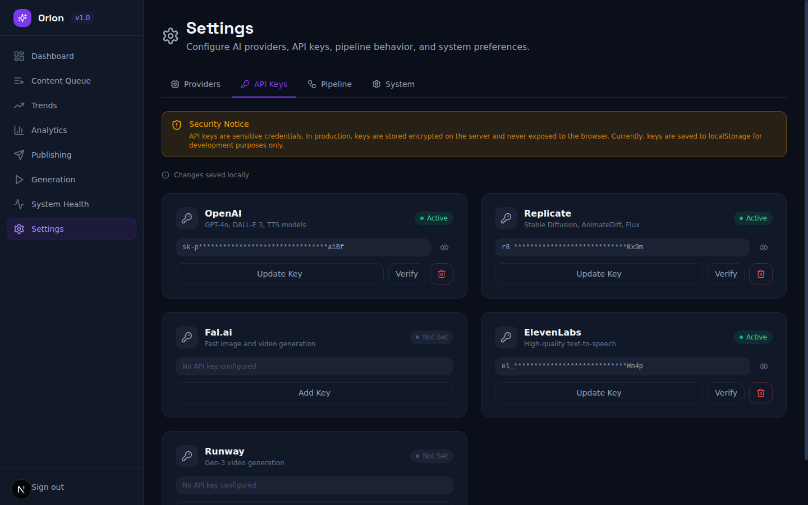
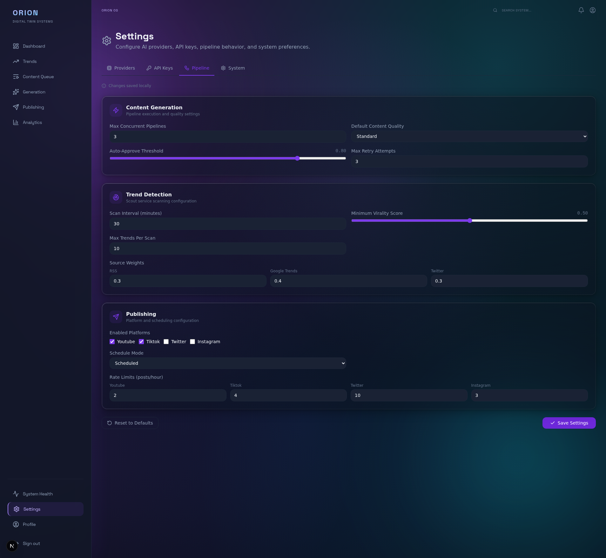
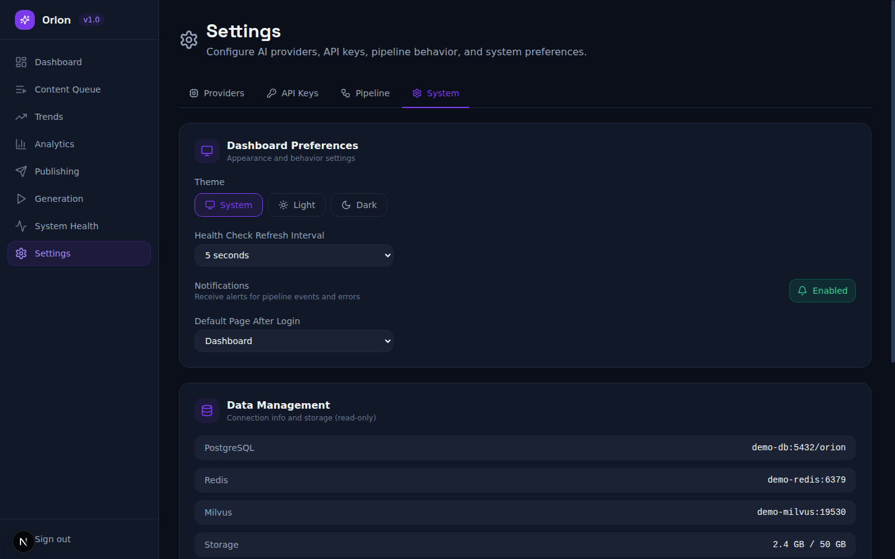
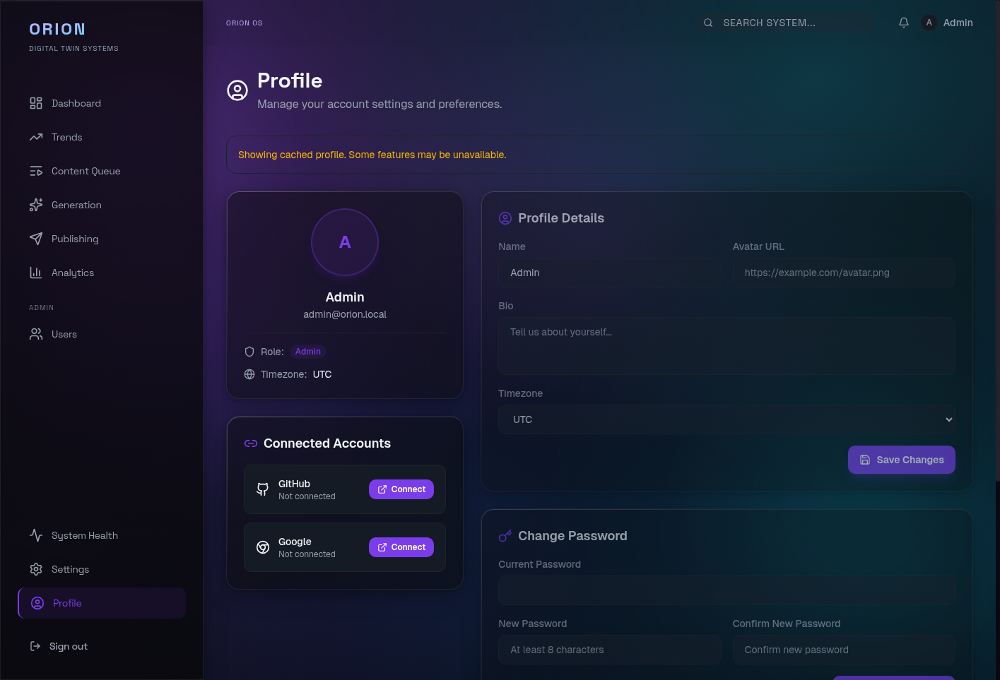

# :lucide-layout-dashboard: Dashboard Overview

A tour of all pages in the Orion Dashboard. Each section describes what you see and highlights the key features.

!!! tip "Try Demo Mode First"
    If you want to explore the dashboard without setting up the full backend, enable demo mode with `NEXT_PUBLIC_DEMO_MODE=true`. See the [Demo Mode guide](demo-mode.md) for details.

---

## :lucide-log-in: Login

The login page authenticates you against the Orion Gateway. You can sign in with:

- **Email and password** -- Enter your credentials and click **Sign in**
- **GitHub OAuth** -- Click the **Continue with GitHub** button to authenticate via your GitHub account
- **Google OAuth** -- Click the **Continue with Google** button to authenticate via your Google account

New users can click the **Register** link to create an account.

---

## :lucide-panel-left: Sidebar Navigation

The sidebar is visible on every page after you log in. It provides quick access to all sections of the dashboard and shows the current Orion version.

Pages available from the sidebar:

| Page | Purpose |
| --- | --- |
| Dashboard | Home page with quick-access cards |
| Content Queue | Review and manage content in the pipeline |
| Trends | Discovered trends and their pipeline status |
| Analytics | Pipeline performance, costs, and provider usage |
| Publishing | Publishing history across platforms |
| Generation | Real-time progress tracking for content generation |
| System Health | System overview, service status, infrastructure, and GPU monitoring |
| Settings | Configure AI providers, API keys, pipeline behavior, and system preferences |
| Profile | User profile, connected OAuth accounts, password change, publishing accounts |
| Admin > Users | User management (admin role only) |
| Settings | AI providers, API keys, pipeline config, and system preferences (4 tabs) |
| Profile | View and edit your account, change password, manage OAuth connections |
| Users (admin) | Manage user accounts, roles, and invitations |

---

## :lucide-home: Dashboard Home

The landing page after login. It shows four quick-access cards that link directly to the most common workflows.

- **Content Queue** -- Jump straight to pending content
- **Trends** -- View detected trends
- **Approved** -- Content ready to publish
- **In Review** -- Content awaiting review

---

## :lucide-list: Content Queue

The central hub for managing content as it moves through the pipeline. Content items are displayed as cards with status badges, confidence scores, and timestamps.

Key features:

- **Status filters** -- Filter by All, Draft, Generating, In Review, Approved, Published, or Rejected
- **Sort options** -- Sort by Date or Score
- **Pagination** -- Navigate through pages of content
- Click any card to view full content details

---

## :lucide-trending-up: Trends

Displays all trends discovered by the Scout service, with summary statistics at the top.

Key features:

- **Summary cards** -- Total Found, Used for Content, and Discarded counts
- **Sortable table** -- Click any column header to sort
- **Status indicators** -- NEW (not yet used), USED (turned into content), DISCARDED (filtered out)
- **Virality score** -- 0.0 to 1.0 score indicating trend strength

---

## :lucide-bar-chart-3: Analytics

Pipeline performance metrics, cost tracking, and provider usage visualizations.

Key features:

- **KPI cards** -- Total Generated, Approval Rate, and Total Cost (last 30 days)
- **Content Pipeline** -- Horizontal bar chart showing content counts at each stage
- **Cost by Provider** -- Bar chart comparing costs across AI providers
- **Provider Usage** -- Donut chart showing the distribution of provider calls
- **Error Trends** -- Line chart of errors over the last 7 days

---

## :lucide-send: Publishing

A table of all publishing activity across platforms (YouTube, TikTok, Twitter, Instagram).

Key features:

- **Status badges** -- Published (green), Pending (yellow), Failed (red)
- **Platform tracking** -- See which platforms each piece of content was published to
- **Post IDs** -- Direct reference to external platform post identifiers

---

## :lucide-loader: Generation

Real-time progress tracking for content generation pipelines. Each content item shows its progress through the six generation stages.

Generation stages:

1. **Research** -- Gathering source material
2. **Script** -- Writing the content script
3. **Critique** -- AI review and quality check
4. **Images** -- Generating visual assets
5. **Video** -- Producing video content
6. **Render** -- Final rendering and assembly

Active items show a progress bar with percentage and estimated time remaining.

---

## :lucide-heart-pulse: System Health

Monitor host resources, service health, infrastructure dependencies, and GPU utilization.

Key features:

- **System Overview** -- Host information (hostname, OS, architecture, CPU cores, uptime) and resource usage bars for CPU, Memory, and Disk
- **Service Status** -- Health indicators for all 7 services (Gateway, Scout, Director, Media, Editor, Publisher, and Pulse) with uptime and queue sizes
- **Infrastructure** -- Redis and PostgreSQL connectivity status with per-service dependency checks (R = Redis, P = Postgres)
- **GPU Status** -- Multi-GPU support with VRAM gauge, utilization, temperature, power draw, clocks, fan speed, driver and CUDA versions

!!! info "Auto-Refresh Intervals"
    GPU metrics poll every **1 second** for near-real-time monitoring. Service status and system overview poll every **5 seconds**. Both panels display a **Live** indicator showing "Updated Xs ago" to confirm data freshness.

---

## :lucide-settings: Settings

The Settings page uses a tabbed interface with four tabs: **Providers**, **API Keys**, **Pipeline**, and **System**.

### :lucide-cpu: Providers Tab

Configure AI providers and model selections for each generation service.

Four provider cards (LLM, Image, Video, TTS) let you switch between **Local** and **Cloud** providers, select a model, and save the configuration. The green dot indicates the provider is connected and available. Each card includes a **Test Connection** button to verify provider reachability and a **Model Parameters** accordion for fine-tuning generation settings.

### :lucide-key: API Keys Tab

Manage cloud provider API keys from the dashboard.

Five cloud provider cards are available: **OpenAI**, **Replicate**, **Fal.ai**, **ElevenLabs**, and **Runway**. Each card displays a masked view of the configured key and provides **Verify** and **Delete** actions.

### :lucide-workflow: Pipeline Tab

Configure content generation and publishing behavior.

- **Content Generation** -- Concurrency limits, quality threshold, auto-approve threshold, and retry count
- **Trend Detection** -- Scan interval, minimum virality score, and source weights
- **Publishing** -- Platform toggles (YouTube, TikTok, Twitter, Instagram), schedule mode, and rate limits

### :lucide-monitor: System Tab

Dashboard preferences and environment information.

- **Dashboard Preferences** -- Theme (light/dark/system), refresh interval, notification toggles, and default landing page. These preferences are saved per-user via the Identity service.
- **Data Management** -- Database and Redis connection information
- **Environment** -- Current environment details and version info

---

## :lucide-user: Profile

The profile page lets you manage your account details and security settings.

- **Account Card** -- View your avatar, name, email, role, and timezone
- **Connected Accounts** -- Link or unlink GitHub and Google OAuth accounts
- **Profile Details** -- Edit your name, avatar URL, bio, and timezone
- **Change Password** -- Update your password (requires current password and confirmation)
- **Publishing Accounts** -- Connect YouTube, TikTok, Twitter/X, and Instagram accounts

---

## :lucide-users: Users (Admin Only)

The admin users page is accessible only to users with the `admin` role. It provides user management capabilities:

- **User List** -- View all registered users with their name, email, role, and status
- **Invite User** -- Send an invitation email to add new users
- **Role Management** -- Change a user's role between `user` and `admin`
- **Account Status** -- Activate or deactivate user accounts

---

## :lucide-arrow-right: Next Steps

- **[Content Workflow](content-workflow.md)** -- Learn how to manage content through the pipeline
- **[Trend Monitoring](trend-monitoring.md)** -- Understand trend detection and usage
- **[Analytics Guide](analytics-guide.md)** -- Deep dive into analytics and cost tracking
- **[System Administration](system-admin.md)** -- Service health and provider configuration
- **[CLI Quickstart](cli-quickstart.md)** -- Get started with the command-line interface
