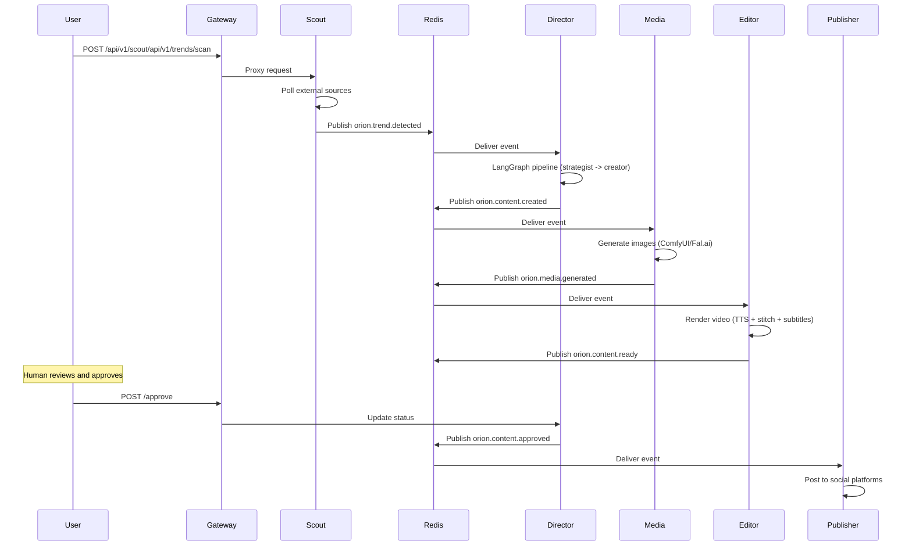

# :lucide-rocket: Full Pipeline Demo

End-to-end walkthrough of the Orion content pipeline: detect a trend, generate content, review it, publish, and monitor the results. This guide covers both the CLI and the Dashboard so you can use whichever interface you prefer.

## :lucide-check-square: Prerequisites

Start the full Orion stack:

```bash
cp .env.example .env
docker compose -f deploy/docker-compose.yml up -d
```

Wait for all services to become healthy:

```bash
docker compose -f deploy/docker-compose.yml ps
```

!!! tip "Demo mode"
    If you don't have the backend running, you can use demo mode instead. See the [Demo Mode guide](demo-mode.md) for setup instructions.

---

## :lucide-search: Step 1: Detect Trends

Trigger the Scout service to scan external sources for trending topics.

!!! tip "Scan Frequency"
    In production, trend scans run on a configurable schedule. For this demo, we trigger a scan manually. You can adjust the automatic scan interval via the `SCOUT_SCAN_INTERVAL` environment variable.

=== "CLI"

    ```bash
    # Authenticate first
    orion auth login
    # Username: admin
    # Password: orion_dev

    # Trigger a trend scan across Google Trends and RSS feeds
    orion scout trigger --sources google,rss --regions US
    ```

    Expected output:

    ```
    Scan triggered successfully.
    Sources: google, rss
    Region:  US
    ```

    View detected trends:

    ```bash
    orion scout trends --limit 5
    ```

    Expected output:

    ```
    ┌────────┬──────────────────────────────────────────────┬───────┬────────────────┬────────┐
    │ ID     │ Topic                                        │ Score │ Source         │ Status │
    ├────────┼──────────────────────────────────────────────┼───────┼────────────────┼────────┤
    │ t-001  │ AI Agents Replace Junior Devs — Hype or ...  │  0.94 │ google_trends  │ NEW    │
    │ t-003  │ Apple Vision Pro 2 Leak Sparks AR/VR Debate  │  0.91 │ twitter        │ NEW    │
    │ t-002  │ Rust Adoption Surges in Enterprise Backend   │  0.87 │ rss            │ NEW    │
    │ t-004  │ Open-Source LLMs Close the Gap on GPT-5      │  0.82 │ google_trends  │ NEW    │
    │ t-006  │ WebAssembly Enters Server-Side Mainstream     │  0.73 │ twitter        │ NEW    │
    └────────┴──────────────────────────────────────────────┴───────┴────────────────┴────────┘
    ```

=== "Dashboard"

    1. Open **http://localhost:3000** and log in with `admin` / `orion_dev`
    2. Navigate to the **Trends** page from the sidebar
    3. Trends are displayed with their virality score, source, and status
    4. New trends detected by Scout appear here automatically via WebSocket updates

---

## :lucide-eye: Step 2: Review Content

Once Scout detects a trend, the Director service automatically picks it up via Redis pub/sub and begins generating content through the LangGraph pipeline (strategist, creator, media, editor stages).

=== "CLI"

    ```bash
    # List content currently being generated
    orion content list --status generating

    # List all content including completed items
    orion content list --limit 10
    ```

    Expected output:

    ```
    ┌────────────┬────────────────────────────────────────────┬────────────┬───────────────────┐
    │ ID         │ Title                                      │ Status     │ Created           │
    ├────────────┼────────────────────────────────────────────┼────────────┼───────────────────┤
    │ c-a1b2c3d4 │ AI Agents: Hype vs Reality in 2026        │ review     │ 2026-03-18 09:15  │
    │ c-e5f6a7b8 │ Why Rust Is Taking Over Enterprise        │ generating │ 2026-03-18 09:20  │
    │ c-c9d0e1f2 │ Vision Pro 2: What We Know So Far         │ generating │ 2026-03-18 09:22  │
    └────────────┴────────────────────────────────────────────┴────────────┴───────────────────┘
    ```

    View full details of a content item:

    ```bash
    orion content view c-a1b2c3d4
    ```

=== "Dashboard"

    1. Navigate to the **Content Queue** page from the sidebar
    2. Content items are listed with their status (generating, review, approved, published)
    3. Click on any item to see its full details: script, media assets, and metadata
    4. Items in **review** status are ready for your approval

---

## :lucide-check-circle: Step 3: Approve Content

Content goes through a human-in-the-loop review stage before publishing.

=== "CLI"

    ```bash
    # Approve content for immediate publishing
    orion content approve c-a1b2c3d4
    ```

    Expected output:

    ```
    Content c-a1b2c3d4 approved.
    Status: approved -> publishing
    ```

    You can also reject content with feedback:

    ```bash
    orion content reject c-a1b2c3d4 --feedback "Tone is too casual" --action REGENERATE
    ```

=== "Dashboard"

    1. Open a content item from the **Content Queue**
    2. Review the generated script, images, and video preview
    3. Click **Approve** to send the content for publishing
    4. Or click **Reject** and provide feedback for regeneration

---

## :lucide-send: Step 4: Publish

Once approved, the Publisher service handles distribution to configured social media accounts.

=== "CLI"

    ```bash
    # List connected social accounts
    orion publish accounts

    # Publish to a specific platform
    orion publish send c-a1b2c3d4 --platform twitter

    # View publishing history
    orion publish history
    ```

    Expected output:

    ```
    Publishing c-a1b2c3d4 to twitter...
    Published successfully.
    Post URL: https://twitter.com/orion_demo/status/1234567890
    ```

=== "Dashboard"

    1. Navigate to the **Publishing** page from the sidebar
    2. Approved content appears in the publishing queue
    3. Select the target platform and click **Publish**
    4. Published items show their external URL and engagement metrics

---

## :lucide-activity: Step 5: Monitor

Track system health, pipeline performance, and content analytics.

=== "CLI"

    ```bash
    # Overall system status
    orion system status

    # Detailed health check of all services
    orion system health --format json
    ```

    Expected output for `orion system status`:

    ```
    Orion System Status
    ───────────────────
    Mode:       LOCAL
    GPU:        Available (NVIDIA RTX 4090, 24GB)
    Services:   6/6 healthy
    Queue:      3 items pending
    Uptime:     2h 15m
    ```

=== "Dashboard"

    1. **Analytics** page — content performance metrics, engagement charts, trend correlation
    2. **System Health** page — service status cards, GPU utilization gauge, queue depth
    3. Real-time updates via WebSocket connections

For deeper observability, see the [Monitoring guide](demo-monitoring.md) for Grafana dashboards and Prometheus metrics.

---

## :lucide-git-branch: What Happens Behind the Scenes

The complete pipeline flow:



Each service communicates exclusively through Redis pub/sub -- there are no direct HTTP calls between Python services.

---

## :lucide-arrow-right: Next Steps

- **[CLI Workflow](demo-cli-workflow.md)** -- CLI-only walkthrough with detailed command reference
- **[Provider Setup](demo-provider-setup.md)** -- Switch between local and cloud AI providers
- **[Monitoring](demo-monitoring.md)** -- Grafana dashboards and Prometheus metrics
- **[Demo Mode](demo-mode.md)** -- Run the dashboard with pre-seeded fixture data
- **[Dashboard Overview](dashboard-overview.md)** -- Tour of all dashboard pages
