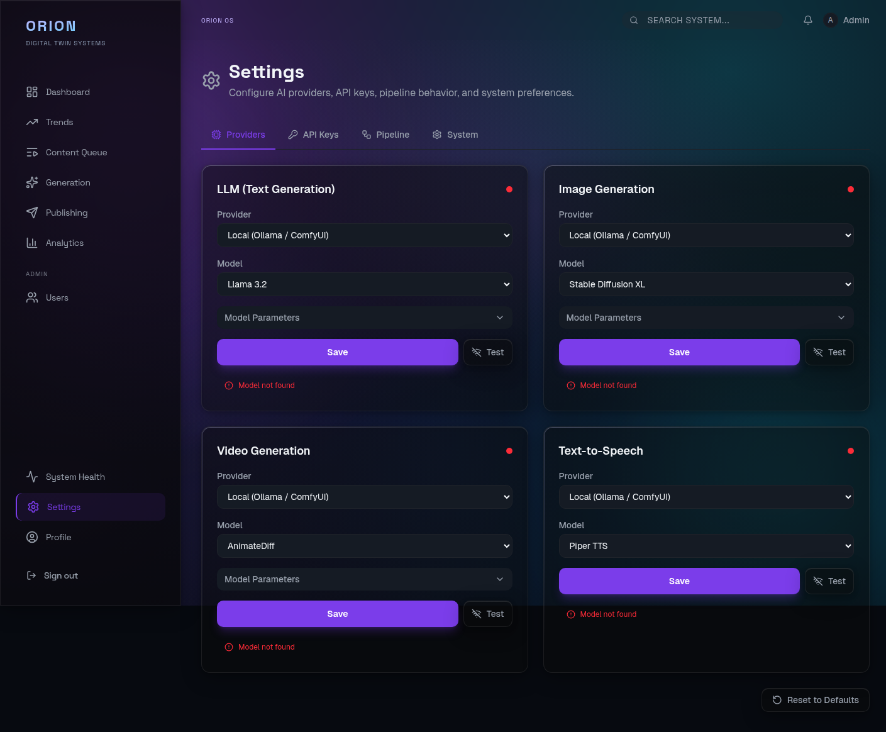

# :lucide-settings: Provider Setup Guide

Orion supports both local (self-hosted) and cloud AI providers. You can switch between them at any time through the Dashboard Settings page or the CLI.

## :lucide-layers: Provider Categories

Orion uses four provider categories, each configurable independently:

| Category                 | Local Options                  | Cloud Options                  |
| ------------------------ | ------------------------------ | ------------------------------ |
| **LLM (Text)**           | Ollama (Llama 3.2, Mistral)   | OpenAI (GPT-4o, GPT-4o Mini)  |
| **Image Generation**     | ComfyUI (SDXL, Flux)          | DALL-E 3                       |
| **Video Generation**     | ComfyUI (AnimateDiff, SVD)    | Runway Gen-3                   |
| **TTS (Voice)**          | Piper TTS, Coqui TTS          | ElevenLabs, OpenAI TTS         |

---

## :lucide-layout-dashboard: Switching Providers via Dashboard

1. Open **http://localhost:3001** (dev) or **http://localhost:3000** (prod) and log in
2. Navigate to **Settings** from the sidebar
3. You will see four provider cards: LLM, Image, Video, and TTS



### :lucide-credit-card: Each Card Shows

- **Provider mode** dropdown: `Local (Ollama / ComfyUI)` or `Cloud (OpenAI / Replicate)`
- **Model** dropdown: available models for the selected mode
- **Connection status**: green check (connected), red alert (disconnected), or spinner (checking)
- **Test Connection** button: click to verify the selected provider is reachable before saving
- **Model Parameters** accordion: expand to adjust generation settings (e.g., temperature, max tokens)

### :lucide-repeat: To Switch a Provider

1. Select the desired mode from the **Provider** dropdown
2. The **Model** dropdown updates to show only models available for that mode
3. Select a model
4. Click **Save** -- the configuration is applied immediately
5. Optionally click **Test Connection** to verify the provider is reachable
6. The status indicator will update to show whether the new provider is reachable

### :lucide-cloud: Example: Switch LLM from Local to Cloud

1. On the **LLM (Text Generation)** card, change Provider to `Cloud (OpenAI / Replicate)`
2. Select `GPT-4o` from the Model dropdown
3. Click Save
4. The status indicator should turn green if the `OPENAI_API_KEY` environment variable is configured

---

## :lucide-terminal: Switching Providers via CLI

```bash
# View current provider configuration
orion provider status
```

```
┌──────────────────┬──────────┬──────────────┬───────────┐
│ Service          │ Mode     │ Model        │ Status    │
├──────────────────┼──────────┼──────────────┼───────────┤
│ LLM              │ LOCAL    │ llama3.2     │ connected │
│ Image            │ LOCAL    │ sdxl         │ connected │
│ Video            │ LOCAL    │ animatediff  │ connected │
│ TTS              │ LOCAL    │ piper        │ connected │
└──────────────────┴──────────┴──────────────┴───────────┘
```

Switch to cloud providers:

```bash
# Switch LLM to OpenAI GPT-4o
orion provider switch llm --mode CLOUD --provider openai --model gpt-4o

# Switch image generation to DALL-E 3
orion provider switch image --mode CLOUD --provider openai --model dall-e-3

# Switch TTS to ElevenLabs
orion provider switch tts --mode CLOUD --provider elevenlabs --model elevenlabs

# Switch back to local
orion provider switch llm --mode LOCAL --provider ollama --model llama3.2
```

---

## :lucide-key: Environment Variables for Cloud Providers

Cloud providers require API keys. Add these to your `.env` file:

=== "OpenAI"

    ```bash
    # OpenAI — for GPT-4o, GPT-4o Mini, DALL-E 3, OpenAI TTS
    OPENAI_API_KEY=sk-...
    ```

=== "Replicate / Fal.ai"

    ```bash
    # Replicate — for Flux, Stable Video Diffusion
    REPLICATE_API_TOKEN=r8_...

    # Fal.ai — for image and video generation
    FAL_KEY=fal_...
    ```

=== "ElevenLabs"

    ```bash
    # ElevenLabs — for voice synthesis
    ELEVENLABS_API_KEY=el_...
    ```

=== "Runway"

    ```bash
    # Runway — for video generation
    RUNWAY_API_KEY=rw_...
    ```

!!! warning "Do not commit `.env` files"
    API keys should never be committed to version control. Use `.env.example` as a template and keep your `.env` file local. Never share API keys in chat, issues, or pull requests. Rotate keys immediately if they are accidentally exposed.

After updating `.env`, restart the affected services:

```bash
docker compose -f deploy/docker-compose.yml restart media editor director
```

---

## :lucide-hard-drive: Local Provider Setup

=== "Ollama (LLM)"

    Ollama runs as a container in the Docker Compose stack. To pull additional models:

    ```bash
    # Pull a model (inside the container)
    docker compose -f deploy/docker-compose.yml exec ollama ollama pull llama3.2

    # Verify available models
    curl http://localhost:11434/api/tags
    ```

=== "ComfyUI (Image/Video)"

    ComfyUI runs on the GPU profile. Start it with:

    ```bash
    docker compose -f deploy/docker-compose.yml --profile gpu up -d
    ```

    Verify ComfyUI is accessible:

    ```bash
    curl http://localhost:8188/system_stats
    ```

---

## :lucide-scale: When to Use Local vs Cloud

| Scenario                            | Recommended    |
| ----------------------------------- | -------------- |
| Development and testing             | Local          |
| Demos without GPU hardware          | Cloud          |
| Production with cost constraints    | Local          |
| Highest quality output              | Cloud          |
| Offline or air-gapped environments  | Local          |
| Rapid prototyping                   | Cloud          |

---

## :lucide-arrow-right: Next Steps

- **[Full Pipeline Demo](demo-full-pipeline.md)** -- End-to-end walkthrough
- **[Monitoring](demo-monitoring.md)** -- Track provider health in Grafana
- **[Configuration Reference](../getting-started/configuration.md)** -- All environment variables
- **[Analytics Guide](analytics-guide.md)** -- Track costs by provider
- **[System Administration](system-admin.md)** -- Service health and GPU monitoring
