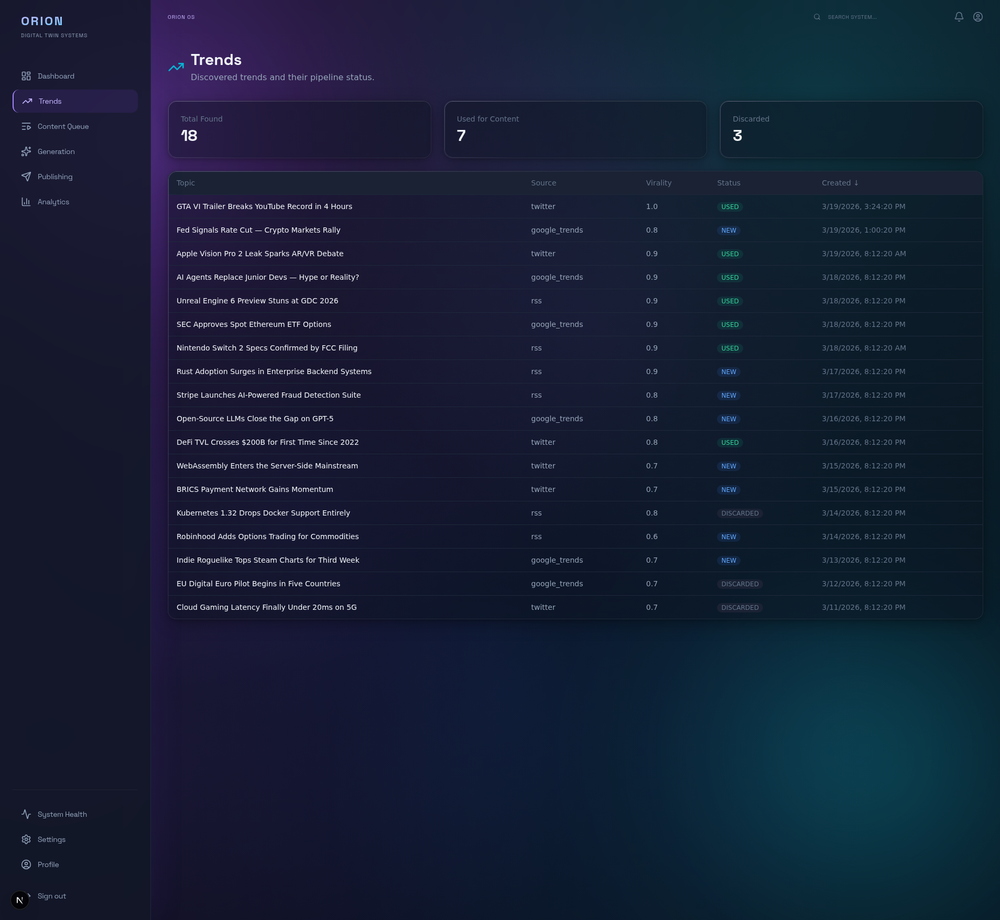
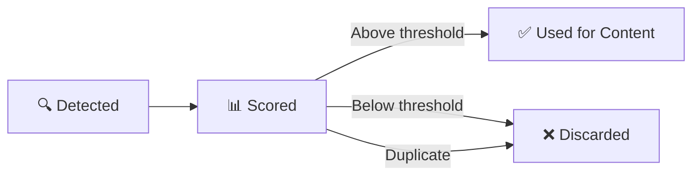

# :lucide-trending-up: Trend Monitoring

How to monitor and understand the trends detected by the Orion Scout service.

---

## :lucide-monitor: Understanding the Trends Page

Navigate to **Trends** from the sidebar. The page shows all trends discovered by the Scout service along with summary statistics.



---

## :lucide-bar-chart-3: Summary Statistics

Three cards at the top provide a quick overview:

| Stat | Meaning |
| --- | --- |
| **Total Found** | Total number of trends detected across all sources |
| **Used for Content** | Trends that were selected and turned into content items |
| **Discarded** | Trends that were filtered out (low relevance, duplicate, or manually discarded) |

---

## :lucide-table: Trend Table Columns

The main table lists every detected trend with the following columns:

| Column | Description |
| --- | --- |
| **Topic** | The trend headline or topic description |
| **Source** | Where the trend was detected: `google_trends`, `twitter`, or `rss` |
| **Virality** | Score from 0.0 to 1.0 indicating trend strength. Higher scores mean the topic is trending more strongly. |
| **Status** | Current state of the trend (see below) |
| **Created** | Timestamp when the trend was first detected |

Click any column header to sort the table by that column. The currently active sort column shows an arrow indicator.

!!! info "Understanding Virality Scores"
    The virality score ranges from **0.0** to **1.0** and is computed from factors like search volume, social media mentions, and growth velocity. Scores above **0.85** are considered strong candidates for content. Scores below **0.5** are typically filtered out automatically. The Director service uses a configurable threshold (default: **0.7**) to decide which trends to pick up.

---

## :lucide-tag: Trend Statuses

| Status | Meaning |
| --- | --- |
| **NEW** | Recently detected, not yet acted upon. Available for content creation. |
| **USED** | Selected and used as the basis for content generation. A corresponding content item exists in the Content Queue. |
| **DISCARDED** | Filtered out by the system or manually discarded. Will not be used for content. |

---

## :lucide-rss: Trend Sources

The Scout service monitors multiple sources for trending topics:

- **google_trends** -- Google Trends data for search volume spikes
- **twitter** -- Twitter/X trending topics and viral posts
- **rss** -- RSS feeds from configured news and tech sources

You can configure which sources the Scout service monitors and which regions to focus on via the CLI:

```bash
orion scout trigger
```

---

## :lucide-workflow: How Trends Become Content

1. The Scout service detects a trend and assigns a virality score
2. Trends above the configured threshold are flagged as candidates
3. The Director service selects the highest-scoring trends for content generation
4. Selected trends move to USED status; a new content item appears in the Content Queue
5. Low-scoring or duplicate trends are automatically moved to DISCARDED



---

## :lucide-arrow-right: Next Steps

- **[Content Workflow](content-workflow.md)** -- Follow trends through the content pipeline
- **[Analytics Guide](analytics-guide.md)** -- See how trends correlate with content performance
- **[CLI Quickstart](cli-quickstart.md)** -- Trigger trend scans from the command line
- **[Dashboard Overview](dashboard-overview.md)** -- Tour of all dashboard pages
- **[Scout Service Docs](../services/index.md)** -- Technical details on the Scout service
