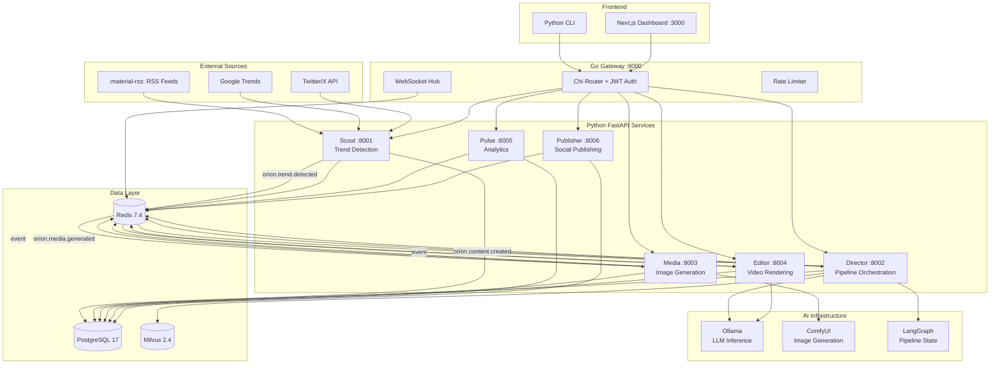

---
hide:
  - navigation
---

# Orion

<div class="orion-hero" markdown>

**Digital Twin Content Agency** — autonomous AI agents that detect trends, generate content, and publish across social platforms.

Orion combines a high-performance Go API gateway with Python FastAPI microservices, LangGraph orchestration, and a Next.js admin dashboard to create a fully automated content production pipeline.

[:material-rocket-launch: Getting Started](getting-started/index.md){ .md-button .md-button--primary }
[:material-book-open-variant: API Reference](api/index.md){ .md-button }
[:material-console: CLI Reference](services/cli.md){ .md-button }
[:lucide-book-open: Guides & Tutorials](guides/index.md){ .md-button }

</div>

---

## :material-sitemap: Platform Architecture

Orion is a distributed system of nine components communicating through a central Redis event bus. External trend data flows in through Scout, gets orchestrated by Director via LangGraph, rendered by Media and Editor, and published by Publisher — all coordinated through event-driven pub/sub.



---

## :material-view-grid: Services Overview

<div class="orion-grid" markdown>

<div class="orion-card" markdown>

### :material-router-wireless: Gateway

Go HTTP gateway on port `8000`. Routes all external requests to Python services, handles JWT authentication, rate limiting with Redis-backed sliding windows, and WebSocket connections for real-time event streaming.

[:material-arrow-right: Learn more](services/gateway.md)

</div>

<div class="orion-card" markdown>

### :material-radar: Scout

Trend detection service on port `8001`. Polls RSS feeds, Google Trends, and Twitter/X for emerging topics. Scores trends by velocity and relevance, deduplicates across sources, and publishes `orion.trend.detected` events to kick off content pipelines.

[:material-arrow-right: Learn more](services/scout.md)

</div>

<div class="orion-card" markdown>

### :material-movie-open: Director

Pipeline orchestration on port `8002`. Uses LangGraph to coordinate the full content creation lifecycle — from strategy generation through script writing — with human-in-the-loop approval gates and Milvus vector memory for context retrieval.

[:material-arrow-right: Learn more](services/director.md)

</div>

<div class="orion-card" markdown>

### :material-image-multiple: Media

Image generation on port `8003`. Interfaces with ComfyUI (local) and Fal.ai (cloud) for text-to-image generation using the Strategy pattern for automatic provider fallback. Generates thumbnails, scene images, and social media assets.

[:material-arrow-right: Learn more](services/media.md)

</div>

<div class="orion-card" markdown>

### :material-video-vintage: Editor

Video rendering on port `8004`. Generates TTS audio via Ollama or cloud providers, transcribes captions, stitches video from generated images, and burns subtitles. Produces short-form video content ready for publishing.

[:material-arrow-right: Learn more](services/editor.md)

</div>

<div class="orion-card" markdown>

### :material-chart-line: Pulse

Analytics engine on port `8005`. Aggregates events from all services, tracks content performance metrics, monitors AI provider costs and latency, and maintains a complete history of every pipeline run.

[:material-arrow-right: Learn more](services/pulse.md)

</div>

<div class="orion-card" markdown>

### :material-send: Publisher

Social publishing on port `8006`. Manages OAuth connections to social platforms and publishes approved content to Twitter/X, YouTube, TikTok, and Instagram with platform-specific formatting and scheduling.

[:material-arrow-right: Learn more](services/publisher.md)

</div>

<div class="orion-card" markdown>

### :material-monitor-dashboard: Dashboard

Next.js 15 admin dashboard on port `3000`. Built with React 19 Server Components, Tailwind CSS 4, and Recharts. Provides real-time pipeline monitoring, content approval workflows, trend visualization, and system administration.

[:material-arrow-right: Learn more](services/dashboard.md)

</div>

</div>

---

## :lucide-book-open: Guides & Tutorials

Visual walkthroughs with screenshots for every part of the platform.

<div class="grid cards" markdown>

-   :lucide-monitor:{ .lg .middle } __Dashboard Tour__

    ---

    Complete visual walkthrough of every dashboard page with screenshots.

    [:material-arrow-right: Take the tour](guides/dashboard-overview.md)

-   :lucide-play:{ .lg .middle } __Demo Mode__

    ---

    Explore the dashboard instantly using demo data — no backend needed.

    [:material-arrow-right: Try demo mode](guides/demo-mode.md)

-   :lucide-workflow:{ .lg .middle } __Full Pipeline Demo__

    ---

    Run the complete content pipeline from trend detection to publishing.

    [:material-arrow-right: Run the pipeline](guides/demo-full-pipeline.md)

-   :lucide-terminal:{ .lg .middle } __CLI Quickstart__

    ---

    Authenticate, trigger scans, manage content, and publish from the CLI.

    [:material-arrow-right: Start with CLI](guides/cli-quickstart.md)

</div>

[:material-arrow-right: See all guides](guides/index.md){ .md-button }

---

## :material-tools: Tech Stack

| Layer         | Technology       | Version        |
| ------------- | ---------------- | -------------- |
| Gateway       | Go               | 1.24           |
| Router        | Chi              | 5.x            |
| CLI           | Python + Typer   | 3.13 / 0.15.x  |
| AI Services   | Python + FastAPI | 3.13 / 0.115.x |
| Validation    | Pydantic         | 2.10.x         |
| ORM           | SQLAlchemy       | 2.0.x          |
| Orchestration | LangGraph        | latest         |
| Dashboard     | Next.js + React  | 15.2 / 19.x    |
| Styling       | Tailwind CSS     | 4.0.x          |
| Database      | PostgreSQL       | 17             |
| Cache / MQ    | Redis            | 7.4            |
| Vector DB     | Milvus           | 2.4            |
| LLM Inference | Ollama           | latest         |
| Image Gen     | ComfyUI          | latest         |

---

## :material-console: Quick Commands

### Build and run

```bash
# Build the Go gateway binary
make build

# Run the gateway locally (port 8000)
make run

# Start all services with Docker Compose
docker compose -f deploy/docker-compose.yml up -d

# Start in development mode with hot reload
docker compose -f deploy/docker-compose.yml -f deploy/docker-compose.dev.yml up

# Start with GPU services (Ollama + ComfyUI)
docker compose -f deploy/docker-compose.yml --profile full up -d
```

### Test and lint

```bash
# Run all Go tests
make test

# Run Go linter
make lint

# Run Python tests for a specific service
cd services/scout && pytest

# Run dashboard tests
cd dashboard && npm test
```

### CLI usage

The CLI is a Python/Typer tool. Install via `cd cli && uv sync`.

```bash
# Authenticate with the gateway
orion auth login

# Check system health
orion system health

# Show system status (mode, GPU, queue depth)
orion system status

# Trigger a trend scan
orion scout trigger

# List detected trends
orion scout list-trends

# List content items
orion content list

# Approve content for publishing
orion content approve <content-id>

# Run CLI tests and linting
make cli-test
make cli-lint
```

---

## :material-lightning-bolt: Quick Links

- [:material-download: Installation](getting-started/installation.md) — Set up the full development environment
- [:material-play: Quickstart](getting-started/quickstart.md) — Run Orion and trigger your first pipeline in 5 minutes
- [:material-api: API Reference](api/endpoints.md) — Full REST endpoint documentation
- [:material-docker: Docker Deployment](deployment/docker.md) — Container orchestration and production setup
- [:material-graph: LangGraph Pipeline](langgraph/index.md) — Content creation graph with HITL gates
- [:material-cog: Configuration](getting-started/configuration.md) — Environment variables and service settings
- [:material-chart-bar: Monitoring](monitoring/index.md) — Prometheus, Grafana, and alerting
- [:lucide-book-open: Guides & Tutorials](guides/index.md) — Visual walkthroughs with screenshots
- [:lucide-monitor: Dashboard Tour](guides/dashboard-overview.md) — See every page of the admin dashboard
