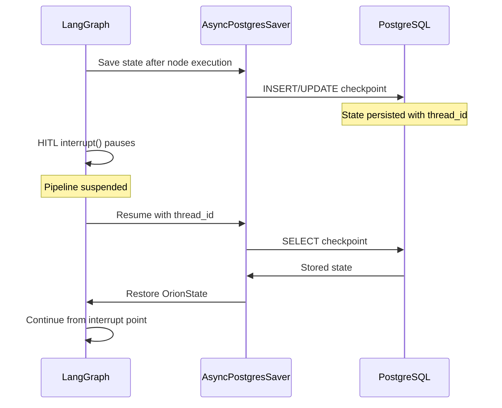

# Checkpoints

LangGraph checkpointing persists pipeline state to PostgreSQL, enabling pause/resume workflows and crash recovery.

## :material-content-save: How Checkpointing Works



## :material-database: Checkpoint Storage

Checkpoints are stored in PostgreSQL using the `AsyncPostgresSaver` class, which implements LangGraph's `BaseCheckpointSaver` interface.

Each checkpoint record contains:

| Field           | Type        | Description                                  |
| --------------- | ----------- | -------------------------------------------- |
| `thread_id`     | `str`       | Unique identifier for the pipeline execution |
| `checkpoint_id` | `str`       | Sequential checkpoint within a thread        |
| `state`         | `jsonb`     | Serialized `OrionState`                      |
| `metadata`      | `jsonb`     | Node name, timestamp, etc.                   |
| `created_at`    | `timestamp` | When the checkpoint was saved                |

## :material-state-machine: State Schema

The `OrionState` TypedDict defines all fields that are checkpointed:

```python
class OrionState(TypedDict):
    # Required: set at pipeline start
    content_id: UUID
    trend_id: UUID
    trend_topic: str
    niche: str
    target_platform: str
    tone: str
    visual_style: str
    current_stage: PipelineStage

    # Strategist outputs
    script_hook: NotRequired[str]
    script_body: NotRequired[str]
    script_cta: NotRequired[str]
    visual_cues: NotRequired[list[str]]

    # Critique outputs
    critique_score: NotRequired[float]
    critique_feedback: NotRequired[str]

    # Creator outputs
    visual_prompts: NotRequired[dict[str, Any]]

    # Analyst outputs
    performance_summary: NotRequired[str]
    improvement_suggestions: NotRequired[list[dict[str, Any]]]
    analyst_score: NotRequired[float]

    # Feedback loop tracking
    iteration_count: NotRequired[int]
    max_iterations: NotRequired[int]

    # HITL decisions (accumulates via operator.add reducer)
    hitl_decisions: NotRequired[Annotated[list[dict], operator.add]]

    # Error tracking
    error: NotRequired[str | None]
```

!!! info "Reducer pattern"
The `hitl_decisions` field uses `Annotated[list, operator.add]` so that each HITL gate **appends** to the list rather than overwriting it. This is a LangGraph pattern for accumulating data across multiple node executions.

## :material-cog: Configuration

Checkpointing is enabled by passing a saver to `build_content_graph()`:

```python
from langgraph.checkpoint.base import BaseCheckpointSaver

checkpointer = AsyncPostgresSaver(session_factory)

graph = build_content_graph(
    script_generator=script_generator,
    critique_agent=critique_agent,
    visual_prompter=visual_prompter,
    checkpointer=checkpointer,
    enable_hitl=True,
)
```

## :material-shield-check: Recovery

If a service crashes mid-pipeline:

1. On restart, the Director queries PostgreSQL for incomplete checkpoints
2. The graph is reconstructed with the same configuration
3. Execution resumes from the last checkpointed state
4. No work is duplicated -- only the interrupted node re-executes

This is particularly important for long-running pipelines that involve multiple LLM calls and image generation steps.
