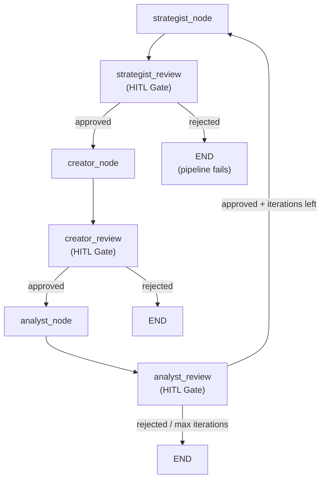

# Human-in-the-Loop

Orion's LangGraph pipeline supports optional HITL interrupt gates between every node, allowing humans to review and approve or reject generated content before it advances.

## :material-hand-back-right: How HITL Works

When `enable_hitl=True` is passed to `build_content_graph()`, interrupt gate nodes are inserted after each processing node:



Each HITL gate uses LangGraph's `interrupt()` function to pause execution and present a review payload to the human reviewer.

## :material-clipboard-check: Review Payloads

### Strategist Review

Presented after script generation and self-critique:

```json
{
  "stage": "strategist",
  "instruction": "Review the generated script and critique. Approve to proceed to visual prompt extraction, or reject with feedback.",
  "script": {
    "hook": "Did you know AI agents can now...",
    "body": "The landscape of AI is changing...",
    "cta": "Follow for more AI insights",
    "visual_cues": ["futuristic cityscape", "robot hands typing"]
  },
  "critique": {
    "score": 0.85,
    "feedback": "Strong hook, body could be more specific..."
  }
}
```

### Creator Review

Presented after visual prompt extraction:

```json
{
  "stage": "creator",
  "instruction": "Review the visual prompts. Approve to finalise content, or reject with feedback.",
  "visual_prompts": {
    "prompts": [
      { "scene": 1, "prompt": "Cinematic shot of futuristic cityscape..." },
      { "scene": 2, "prompt": "Close-up of robot hands typing..." }
    ]
  },
  "script_summary": {
    "hook": "Did you know AI agents can now...",
    "cta": "Follow for more AI insights"
  }
}
```

### Analyst Review

Presented after performance analysis:

```json
{
  "stage": "analyst",
  "instruction": "Review the performance analysis and improvement suggestions. Approve to cycle back for improvements, or reject to finalise as-is.",
  "performance_summary": "Content scores well on engagement...",
  "improvement_suggestions": [
    { "type": "hook", "suggestion": "Make the opening more provocative" }
  ],
  "analyst_score": 0.78,
  "iteration_count": 0,
  "max_iterations": 3
}
```

## :material-reply: Resuming a Paused Pipeline

When a pipeline is paused at an HITL gate, resume it via the Director API:

=== "curl"

    ```bash
    # Approve
    curl -X POST http://localhost:8000/api/v1/director/api/v1/content/resume \
      -H "Authorization: Bearer $TOKEN" \
      -H "Content-Type: application/json" \
      -d '{
        "thread_id": "thread-uuid",
        "approved": true
      }'

    # Reject with feedback
    curl -X POST http://localhost:8000/api/v1/director/api/v1/content/resume \
      -H "Authorization: Bearer $TOKEN" \
      -H "Content-Type: application/json" \
      -d '{
        "thread_id": "thread-uuid",
        "approved": false,
        "feedback": "Hook needs to be more engaging"
      }'
    ```

=== "Python"

    ```python
    # Approve
    resp = httpx.post(
        "http://localhost:8000/api/v1/director/api/v1/content/resume",
        headers={"Authorization": f"Bearer {token}"},
        json={"thread_id": "thread-uuid", "approved": True},
    )

    # Reject with feedback
    resp = httpx.post(
        "http://localhost:8000/api/v1/director/api/v1/content/resume",
        headers={"Authorization": f"Bearer {token}"},
        json={
            "thread_id": "thread-uuid",
            "approved": False,
            "feedback": "Hook needs to be more engaging",
        },
    )
    ```

## :material-state-machine: Decision Tracking

HITL decisions are accumulated in the `hitl_decisions` state key using LangGraph's `Annotated[list, operator.add]` reducer pattern:

```python
# After multiple gates, state contains:
state["hitl_decisions"] = [
    {"stage": "strategist", "approved": True, "feedback": None},
    {"stage": "creator", "approved": True, "feedback": None},
    {"stage": "analyst", "approved": False, "feedback": "Finalize as-is"},
]
```

## :material-rotate-left: Feedback Loop

When the analyst HITL gate is approved:

1. The graph checks `iteration_count` against `max_iterations` (default: 3)
2. If iterations remain, the graph routes back to `strategist_node`
3. The strategist receives `improvement_suggestions` from the analyst
4. `iteration_count` is incremented
5. A new script is generated incorporating the feedback
