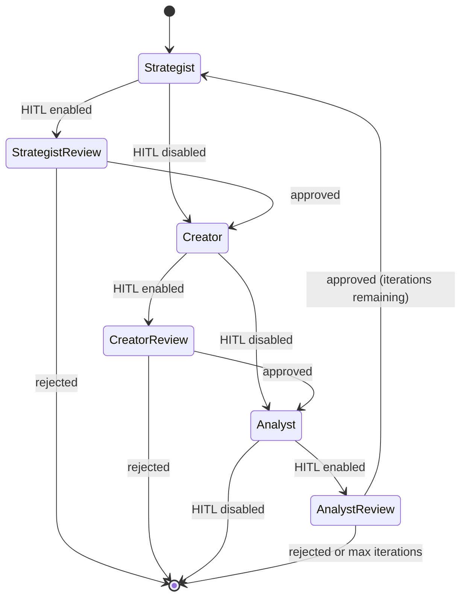

# LangGraph Pipeline

The Director service uses [LangGraph](https://langchain-ai.github.io/langgraph/) to orchestrate the content creation pipeline as a stateful, checkpointed graph with human-in-the-loop (HITL) approval gates.

## :material-graph: Pipeline Overview



## :material-layers: Components

| Component               | Source             | Purpose                                         |
| ----------------------- | ------------------ | ----------------------------------------------- |
| `OrionState`            | `graph/state.py`   | TypedDict defining shared pipeline state        |
| `build_content_graph()` | `graph/builder.py` | Factory function that constructs the StateGraph |
| Node functions          | `graph/nodes.py`   | Thin async wrappers around agent classes        |
| Edge routers            | `graph/edges.py`   | Conditional routing functions                   |
| HITL helpers            | `graph/hitl.py`    | Interrupt payload builders                      |

## :material-state-machine: Pipeline Stages

The `PipelineStage` enum tracks the current position:

| Stage        | Description                                      |
| ------------ | ------------------------------------------------ |
| `STRATEGIST` | Script generation and self-critique              |
| `CREATOR`    | Visual prompt extraction                         |
| `ANALYST`    | Performance analysis and improvement suggestions |
| `COMPLETE`   | Pipeline finished successfully                   |
| `FAILED`     | Pipeline encountered an error                    |

## :material-cog: Configuration

The graph is built via `build_content_graph()` with injectable dependencies:

```python
graph = build_content_graph(
    script_generator=script_generator,
    critique_agent=critique_agent,
    visual_prompter=visual_prompter,
    analyst_agent=analyst_agent,      # Optional
    session_factory=session_factory,  # Required if analyst provided
    checkpointer=checkpointer,       # Optional PostgreSQL saver
    enable_hitl=True,                 # Toggle HITL gates
)
```

## :material-book-open-variant: Sections

- [Nodes](nodes.md) -- Detailed node function documentation
- [Human-in-the-Loop](hitl.md) -- HITL interrupt gates and review payloads
- [Checkpoints](checkpoints.md) -- State persistence and recovery
