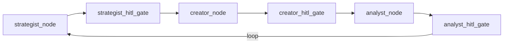

# Nodes

Graph nodes are async functions in `services/director/src/graph/nodes.py` that wrap existing agent classes. Each node receives the shared `OrionState` and returns a partial state update dict.

## :material-source-branch: Node Graph

## :material-movie-edit: `strategist_node`

Generates an H-V-C script (Hook, Visual body, CTA) and runs self-critique.

**Injected dependencies:**

- `ScriptGenerator` -- Generates scripts via Ollama
- `CritiqueAgent` -- Self-critiques for quality assurance

**Inputs from state:**

| Key                       | Type   | Description                                          |
| ------------------------- | ------ | ---------------------------------------------------- |
| `trend_topic`             | `str`  | Topic to write about                                 |
| `niche`                   | `str`  | Content niche (default: `"technology"`)              |
| `target_platform`         | `str`  | Target platform (default: `"youtube_shorts"`)        |
| `tone`                    | `str`  | Desired tone (default: `"informative and engaging"`) |
| `improvement_suggestions` | `list` | Feedback from analyst (on re-entry)                  |

**Outputs to state:**

| Key                 | Type            | Description                                    |
| ------------------- | --------------- | ---------------------------------------------- |
| `script_hook`       | `str`           | Opening hook line                              |
| `script_body`       | `str`           | Main script body                               |
| `script_cta`        | `str`           | Call-to-action                                 |
| `visual_cues`       | `list[str]`     | Visual cue descriptions                        |
| `critique_score`    | `float`         | Quality confidence score                       |
| `critique_feedback` | `str`           | Critique feedback text                         |
| `current_stage`     | `PipelineStage` | Set to `CREATOR` on success, `FAILED` on error |

---

## :material-palette: `creator_node`

Extracts image generation prompts from the strategist's script.

**Injected dependencies:**

- `VisualPrompter` -- Converts script visual cues into structured prompts

**Inputs from state:**

| Key            | Type                           |
| -------------- | ------------------------------ |
| `script_hook`  | `str`                          |
| `script_body`  | `str`                          |
| `script_cta`   | `str`                          |
| `visual_cues`  | `list[str]`                    |
| `visual_style` | `str` (default: `"cinematic"`) |

**Outputs to state:**

| Key              | Type            | Description                               |
| ---------------- | --------------- | ----------------------------------------- |
| `visual_prompts` | `dict`          | Serialized `PromptSet` with image prompts |
| `current_stage`  | `PipelineStage` | Set to `COMPLETE` on success              |

---

## :material-chart-bar: `analyst_node`

Analyzes pipeline performance and generates improvement suggestions. This node is optional and requires both an `AnalystAgent` and a database session factory.

**Injected dependencies:**

- `AnalystAgent` -- Performance analysis via LLM
- `session_factory` -- Async database session context manager

**Inputs from state:**

| Key              | Type    |
| ---------------- | ------- |
| `content_id`     | `UUID`  |
| `niche`          | `str`   |
| `script_hook`    | `str`   |
| `script_body`    | `str`   |
| `critique_score` | `float` |

**Outputs to state:**

| Key                       | Type            | Description                  |
| ------------------------- | --------------- | ---------------------------- |
| `performance_summary`     | `str`           | Text summary of analysis     |
| `improvement_suggestions` | `list[dict]`    | Actionable suggestions       |
| `analyst_score`           | `float`         | Overall quality score        |
| `current_stage`           | `PipelineStage` | Set to `COMPLETE` on success |

---

## :material-transit-connection: Edge Routing

Conditional edges in `graph/edges.py` determine the next node:

| Function                   | From           | Routes To                 | Logic                                                    |
| -------------------------- | -------------- | ------------------------- | -------------------------------------------------------- |
| `route_after_strategist`   | strategist     | `creator` or `END`        | `END` if `FAILED`                                        |
| `route_after_creator`      | creator        | `analyst` or `END`        | `END` if `FAILED`                                        |
| `route_after_creator_hitl` | creator (HITL) | `creator_review` or `END` | `END` if `FAILED`                                        |
| `route_after_analyst`      | analyst        | `END`                     | Always terminates                                        |
| `route_after_analyst_hitl` | analyst_review | `strategist` or `END`     | Loops if approved and `iteration_count < max_iterations` |

!!! note "Feedback Loop"
When the analyst HITL gate is approved and iterations remain (default max: 3), the graph loops back to the strategist with `improvement_suggestions` populated. The `iteration_count` increments on each loop.
