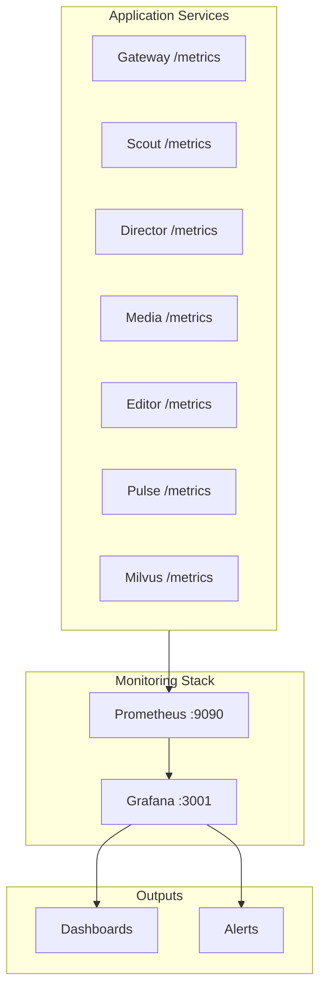

# :lucide-activity: Monitoring

Orion includes a built-in observability stack with Prometheus for metrics collection, Grafana for visualization, and structured logging via slog (Go) and structlog (Python).

## :material-layers: Observability Stack



## :material-check-circle: What's Included

| Component                  | Purpose                                   | Port        |
| -------------------------- | ----------------------------------------- | ----------- |
| Prometheus                 | Metrics scraping and storage              | 9090        |
| Alertmanager               | Alert routing, deduplication, silencing    | 9093        |
| Grafana                    | Dashboard visualization and alerting      | 3001        |
| Service /metrics endpoints | Per-service Prometheus metrics            | Per service |
| Structured logging         | Request-level logging with slog/structlog | --          |

!!! info "Starting the monitoring stack"
    ```bash
    make up-monitoring
    ```
    This uses `deploy/docker-compose.monitoring.yml` alongside the main compose file.

## :material-book-open-variant: Sections

<div class="grid cards" markdown>

-   :lucide-gauge: **[Prometheus](prometheus.md)**

    ---

    Scrape configuration and metrics

-   :lucide-bar-chart-3: **[Grafana](grafana.md)**

    ---

    Dashboards and datasources

-   :lucide-bell: **[Alerts](alerts.md)**

    ---

    Alert rules and notification

-   :lucide-scroll-text: **[Logging](logging.md)**

    ---

    Structured logging setup

</div>

---

!!! tip ":lucide-book-open: Visual Guides"
    - **[System Administration](../guides/system-admin.md)** — Monitor service health and GPU usage in the dashboard
    - **[Monitoring Demo](../guides/demo-monitoring.md)** — Set up Prometheus, Grafana, and alerting
