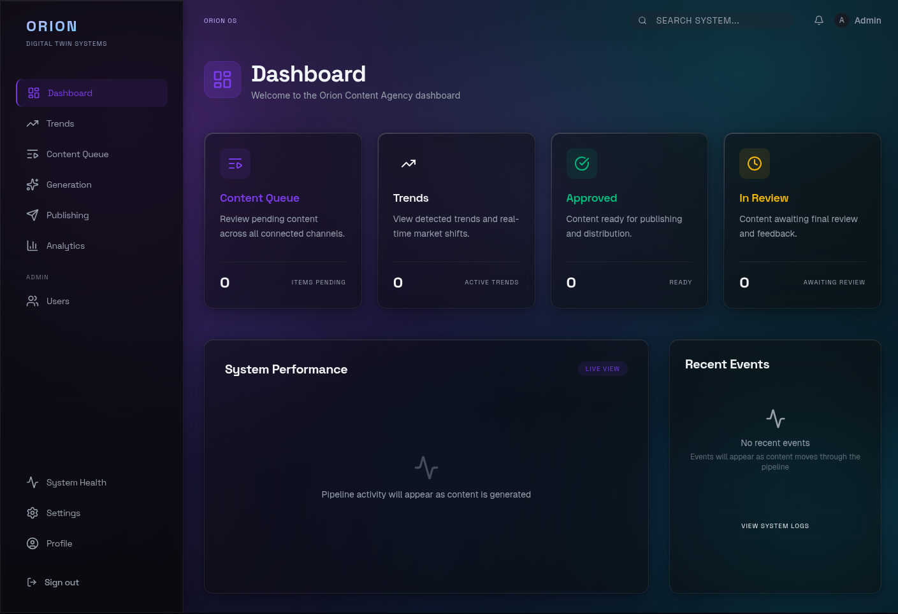
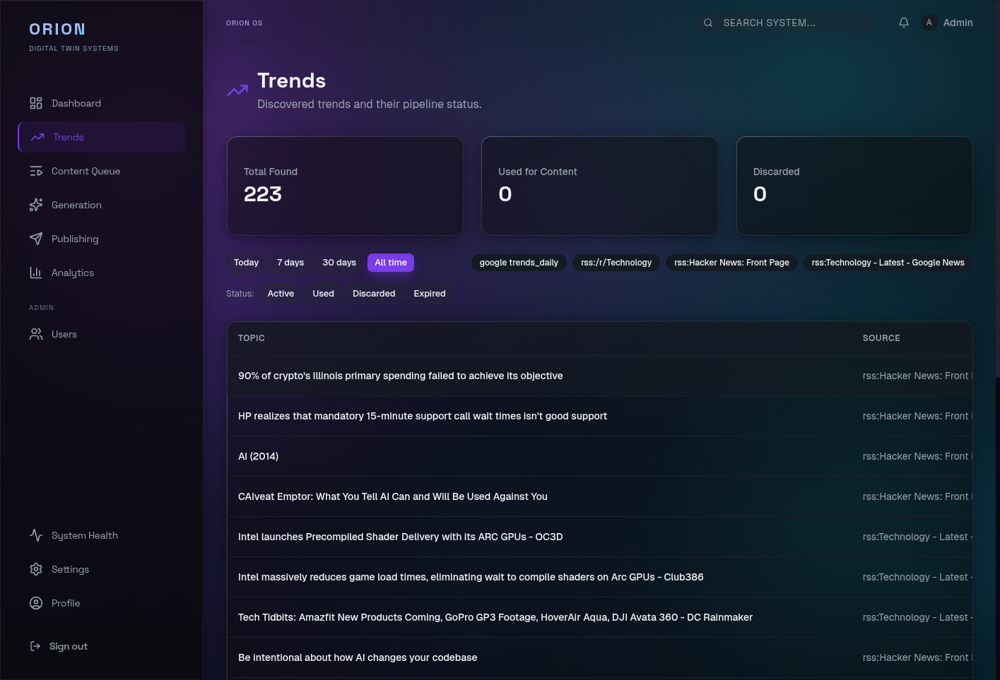
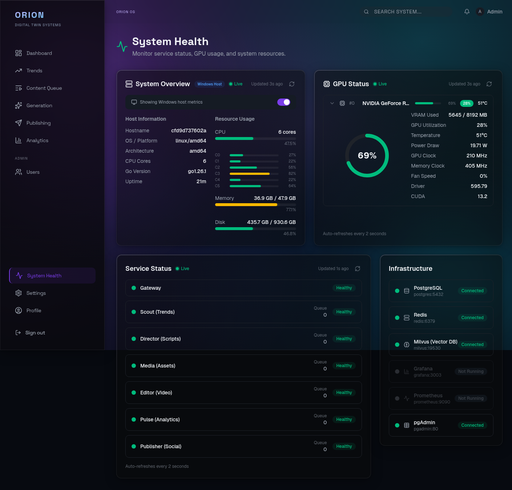

# Dashboard

Next.js 15 admin dashboard for monitoring content pipelines, reviewing trends, and managing the Orion platform.

| Property      | Value                           |
| ------------- | ------------------------------- |
| **Port**      | 3000 (prod) / 3001 (dev)        |
| **Language**  | TypeScript 5.x                  |
| **Framework** | Next.js 15.2 + React 19         |
| **Source**    | `dashboard/`                    |

## :material-tools: Tech Stack

| Library               | Version   | Purpose                        |
| --------------------- | --------- | ------------------------------ |
| Next.js               | 15.2      | App Router framework           |
| React                 | 19.x      | UI library (Server Components) |
| Tailwind CSS          | 4.0       | Utility-first styling          |
| Recharts              | 3.8       | Data visualization             |
| Lucide React          | 0.468     | Icon library                   |
| clsx + tailwind-merge | 2.1 / 2.6 | Conditional class utilities    |

## :material-folder-outline: Architecture

The dashboard uses the App Router (not Pages Router):

```
dashboard/
  src/
    app/
      layout.tsx        # Root layout with providers
      page.tsx           # Landing page
      loading.tsx        # Global loading state
      error.tsx          # Global error boundary
      (routes)/          # Route groups
    components/          # Shared components
    lib/                 # Utilities, API client, helpers
```

### Key Patterns

- **Server Components by default** -- `"use client"` added only for interactivity
- **Server Actions for mutations** -- No API routes unless necessary
- **Tailwind utility classes only** -- No CSS modules or styled-components
- **`cn()` helper** -- Combines `clsx` + `tailwind-merge` for conditional classes
- **Strict TypeScript** -- No `any` types

### Key Pages

| Page | Route | Description |
| ---- | ----- | ----------- |
| **Dashboard** | `/` | Overview cards (Content Queue, Trends, Approved, In Review), System Performance chart, Recent Events |
| **Trends** | `/trends` | Discovered trends table with source/score/status filters, time range selectors, pagination |
| **Content Queue** | `/queue` | Content items with status filters, detail view, approve/reject actions |
| **Generation** | `/generation` | Three tabs: Pipeline (content generation), Media (image assets), Video (rendered videos) |
| **Publishing** | `/publishing` | Publishing history and social account management |
| **Analytics** | `/analytics` | KPI cards, Content Pipeline funnel, Cost by Provider, Provider Usage, Error Trends, Earnings |
| **Profile** | `/profile` | User profile, connected OAuth accounts, password change, publishing accounts |
| **System Health** | `/system` | System overview (host info, CPU/memory/disk bars), GPU status with live gauge, service status for all 7 services, infrastructure panel (PostgreSQL/Redis/Milvus/Grafana/Prometheus/pgAdmin) |
| **Settings** | `/settings` | Four tabs: Providers (LLM/Image/Video/TTS config), API Keys, Pipeline settings, System preferences |
| **Admin Users** | `/admin/users` | User management table (admin only) |







## :material-cog: Configuration

| Variable                  | Default                 | Description          |
| ------------------------- | ----------------------- | -------------------- |
| `NEXT_PUBLIC_GATEWAY_URL` | `http://localhost:8000` | Gateway API base URL |

## :material-console: Commands

```bash
# Development
cd dashboard && npm run dev

# Production build
cd dashboard && npm run build

# Start production server
cd dashboard && npm run start

# Lint
cd dashboard && npm run lint
```

---

!!! tip ":lucide-book-open: Visual Guide Available"
    See the **[Dashboard Tour](../guides/dashboard-overview.md)** for a complete walkthrough of every page with screenshots, or try **[Demo Mode](../guides/demo-mode.md)** to explore without a backend.
