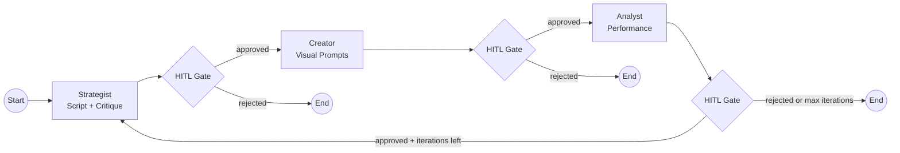

# Director

Pipeline orchestration service that uses LangGraph to coordinate content creation with HITL approval gates and vector memory.

| Property         | Value                |
| ---------------- | -------------------- |
| **Port**         | 8002                 |
| **Language**     | Python 3.13          |
| **Framework**    | FastAPI + LangGraph  |
| **Source**       | `services/director/` |
| **Route prefix** | `/api/v1/content`    |

## :material-api: Endpoints

### `POST /api/v1/content/generate`

Trigger content generation from a trend.

**Request body:**

```json
{
  "trend_id": "550e8400-e29b-41d4-a716-446655440000",
  "trend_topic": "AI agents in production",
  "niche": "technology",
  "target_platform": "youtube_shorts",
  "tone": "informative and engaging",
  "visual_style": "cinematic"
}
```

**Target platforms:** `youtube_shorts`, `tiktok`, `instagram_reels`, `youtube`

=== "curl"

    ```bash
    curl -X POST http://localhost:8000/api/v1/director/api/v1/content/generate \
      -H "Authorization: Bearer $TOKEN" \
      -H "Content-Type: application/json" \
      -d '{
        "trend_id": "550e8400-e29b-41d4-a716-446655440000",
        "trend_topic": "AI agents in production",
        "target_platform": "youtube_shorts"
      }'
    ```

=== "Python"

    ```python
    resp = httpx.post(
        "http://localhost:8000/api/v1/director/api/v1/content/generate",
        headers={"Authorization": f"Bearer {token}"},
        json={
            "trend_id": "550e8400-e29b-41d4-a716-446655440000",
            "trend_topic": "AI agents in production",
            "target_platform": "youtube_shorts",
        },
    )
    content = resp.json()
    ```

---

### `POST /api/v1/content/resume`

Resume a paused HITL pipeline.

```json
{
  "thread_id": "thread-uuid",
  "approved": true,
  "feedback": "Looks good, proceed with generation"
}
```

---

### `GET /api/v1/content`

List content items with optional status filter.

| Param    | Type   | Default |
| -------- | ------ | ------- |
| `status` | string | --      |
| `limit`  | int    | 20      |
| `offset` | int    | 0       |

---

### `GET /api/v1/content/{content_id}`

Get full content details including script, visual prompts, and pipeline status.

---

### `GET /api/v1/content/{content_id}/visual-prompts`

Get visual prompts generated for a content item.

## :material-graph: LangGraph Pipeline

The Director builds a `StateGraph` with the following nodes:



See [LangGraph](../langgraph/index.md) for detailed pipeline documentation.

## :material-brain: Key Components

| Component            | Purpose                                                     |
| -------------------- | ----------------------------------------------------------- |
| `ScriptGenerator`    | Generates H-V-C scripts (hook, visual body, CTA) via Ollama |
| `CritiqueAgent`      | Self-critiques generated scripts for quality                |
| `VisualPrompter`     | Extracts image generation prompts from scripts              |
| `AnalystAgent`       | Analyzes pipeline performance and suggests improvements     |
| `AsyncPostgresSaver` | LangGraph state checkpointer                                |
| `VectorMemory`       | Milvus-backed similarity search for content context         |

## :material-message-arrow-right: Events

| Direction  | Channel                        | Description                  |
| ---------- | ------------------------------ | ---------------------------- |
| Published  | `orion.content.created`        | Content generation completed |
| Published  | `orion.pipeline.stage_changed` | Pipeline stage transition    |
| Subscribed | `orion.trend.detected`         | Auto-triggers pipeline       |
| Subscribed | `orion.content.rejected`       | Triggers regeneration        |
