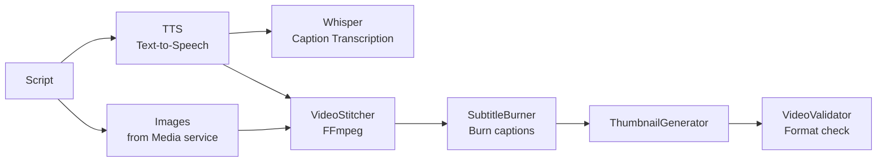

# Editor

Video rendering service that generates TTS audio, transcribes captions, stitches video from images, and burns subtitles.

| Property         | Value              |
| ---------------- | ------------------ |
| **Port**         | 8004               |
| **Language**     | Python 3.13        |
| **Framework**    | FastAPI            |
| **Source**       | `services/editor/` |
| **Route prefix** | `/api/v1/editor`   |

## :material-api: Endpoints

### `POST /api/v1/editor/render`

Trigger the full video rendering pipeline.

**Request body:**

```json
{
  "content_id": "content-uuid",
  "voice_id": "default",
  "subtitle_style": "tiktok",
  "video_width": 1080,
  "video_height": 1920
}
```

**Response:**

```json
{
  "content_id": "content-uuid",
  "status": "rendering",
  "pipeline_run_id": "run-uuid",
  "message": "Render pipeline started"
}
```

=== "curl"

    ```bash
    curl -X POST http://localhost:8000/api/v1/editor/api/v1/editor/render \
      -H "Authorization: Bearer $TOKEN" \
      -H "Content-Type: application/json" \
      -d '{
        "content_id": "content-uuid",
        "subtitle_style": "tiktok"
      }'
    ```

=== "Python"

    ```python
    resp = httpx.post(
        "http://localhost:8000/api/v1/editor/api/v1/editor/render",
        headers={"Authorization": f"Bearer {token}"},
        json={
            "content_id": "content-uuid",
            "subtitle_style": "tiktok",
        },
    )
    result = resp.json()
    ```

---

### `POST /api/v1/editor/tts`

Generate TTS audio (standalone).

```json
{
  "text": "Welcome to the future of AI content creation",
  "voice_id": "default",
  "speed": 1.0,
  "output_format": "mp3"
}
```

**Response:**

```json
{
  "file_path": "/data/audio/tts_abc123.mp3",
  "duration_seconds": 4.2,
  "provider": "ollama"
}
```

---

### `POST /api/v1/editor/captions`

Generate captions from audio (standalone).

```json
{
  "audio_path": "/data/audio/tts_abc123.mp3",
  "language": "en"
}
```

**Response:**

```json
{
  "segments": [
    { "start": 0.0, "end": 2.1, "text": "Welcome to the future" },
    { "start": 2.1, "end": 4.2, "text": "of AI content creation" }
  ],
  "full_text": "Welcome to the future of AI content creation",
  "language": "en",
  "srt": "1\n00:00:00,000 --> 00:00:02,100\nWelcome to the future\n..."
}
```

---

### `GET /api/v1/editor/render/{content_id}/status`

Check the render pipeline status for a content item.

## :material-video-vintage: Render Pipeline



### Pipeline Components

| Component            | Technology     | Purpose                               |
| -------------------- | -------------- | ------------------------------------- |
| `TTSProvider`        | Ollama / Cloud | Text-to-speech audio generation       |
| `WhisperCaptioner`   | Whisper        | Audio transcription to timed segments |
| `VideoStitcher`      | FFmpeg         | Combine images + audio into video     |
| `SubtitleBurner`     | FFmpeg         | Overlay captions onto video           |
| `ThumbnailGenerator` | FFmpeg         | Extract/generate video thumbnail      |
| `VideoValidator`     | FFmpeg         | Validate output meets platform specs  |

### Subtitle Styles

| Style     | Description                               |
| --------- | ----------------------------------------- |
| `tiktok`  | Bold, centered, word-by-word highlighting |
| `youtube` | Standard YouTube subtitle formatting      |
| `minimal` | Small, bottom-aligned subtitles           |

**Default video dimensions:** 1080 x 1920 (9:16 vertical for short-form)

## :material-message-arrow-right: Events

| Direction  | Channel                 | Description                   |
| ---------- | ----------------------- | ----------------------------- |
| Subscribed | `orion.media.generated` | Auto-triggers render pipeline |
