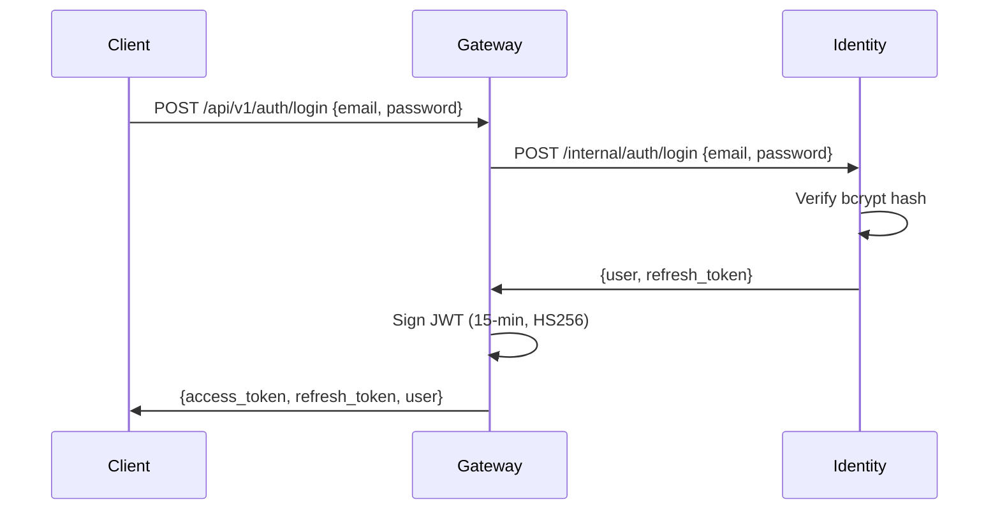
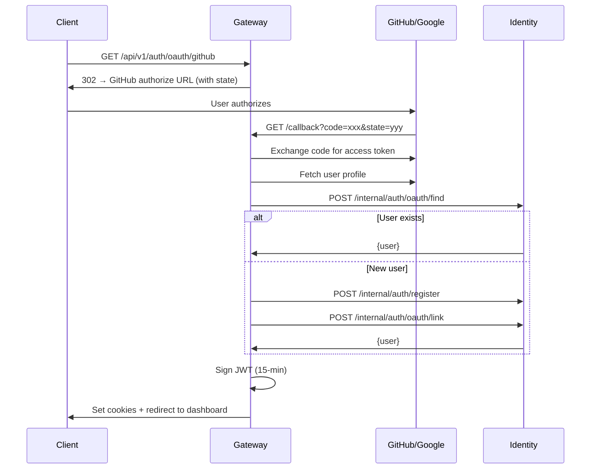
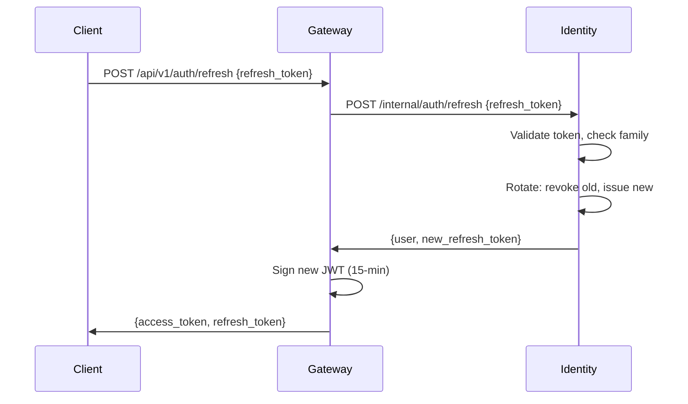
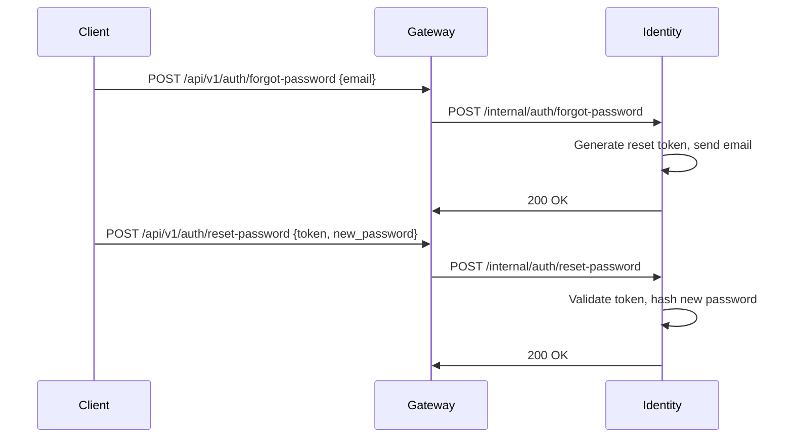

# :lucide-shield: Identity

User management and authentication service. Handles user CRUD, OAuth account linking, token lifecycle, and transactional emails.

| Property         | Value                    |
| ---------------- | ------------------------ |
| **Port**         | 8007                     |
| **Language**     | Python 3.13              |
| **Framework**    | FastAPI                  |
| **Source**       | `services/identity/`     |
| **Route prefix** | `/api/v1/identity`       |

## :material-layers: Architecture

The Identity service follows the standard repository pattern:

```
routes → service → repository → database
```

- **Routes** — FastAPI endpoints for user management and internal auth operations
- **Service** — Business logic for password hashing, token rotation, email dispatch
- **Repository** — SQLAlchemy 2.0 async queries against the `users`, `refresh_tokens`, and `oauth_accounts` tables

## :material-api: Endpoints

### Internal Endpoints (called by Gateway only)

These endpoints are not exposed through the gateway proxy. The gateway calls them directly during authentication flows.

| Method | Path                              | Description                        |
| ------ | --------------------------------- | ---------------------------------- |
| `POST` | `/internal/auth/login`            | Validate email/password            |
| `POST` | `/internal/auth/register`         | Create new user account            |
| `POST` | `/internal/auth/refresh`          | Rotate refresh token               |
| `POST` | `/internal/auth/revoke`           | Revoke a refresh token             |
| `POST` | `/internal/auth/oauth/link`       | Link OAuth account to user         |
| `POST` | `/internal/auth/oauth/find`       | Find user by OAuth provider + ID   |
| `POST` | `/internal/auth/forgot-password`  | Initiate password reset            |
| `POST` | `/internal/auth/reset-password`   | Complete password reset with token |
| `POST` | `/internal/auth/verify-email`     | Verify email with token            |

### Public Endpoints (proxied through Gateway)

| Method | Path                                   | Auth    | Description                    |
| ------ | -------------------------------------- | ------- | ------------------------------ |
| `GET`  | `/api/v1/identity/users/me`            | Bearer  | Get current user profile       |
| `PUT`  | `/api/v1/identity/users/me`            | Bearer  | Update current user profile    |
| `GET`  | `/api/v1/identity/users/me/settings`   | Bearer  | Get user preferences           |
| `PUT`  | `/api/v1/identity/users/me/settings`   | Bearer  | Update user preferences        |
| `PUT`  | `/api/v1/identity/users/me/password`   | Bearer  | Change password                |
| `GET`  | `/api/v1/identity/users`               | Admin   | List all users                 |
| `POST` | `/api/v1/identity/users/invite`        | Admin   | Invite new user via email      |
| `PUT`  | `/api/v1/identity/users/:id/role`      | Admin   | Change user role               |
| `PUT`  | `/api/v1/identity/users/:id/status`    | Admin   | Activate/deactivate user       |

## :material-key: Auth Flows

### Email/Password Login



### OAuth Login (GitHub/Google)



### Token Refresh



### Password Reset



## :material-cog: Configuration

| Variable       | Default                  | Description                          |
| -------------- | ------------------------ | ------------------------------------ |
| `DATABASE_URL` | (from CommonSettings)    | PostgreSQL connection                |
| `REDIS_URL`    | `redis://localhost:6379` | Redis for session/token caching      |
| `SMTP_HOST`    | `localhost`              | SMTP server for transactional emails |
| `SMTP_PORT`    | `587`                    | SMTP port                            |
| `SMTP_USER`    | --                       | SMTP username                        |
| `SMTP_PASS`    | --                       | SMTP password                        |
| `SMTP_FROM`    | `noreply@orion.local`    | From address for emails              |

!!! info "Email in Development"
    In development mode, transactional emails (verification, reset, invite) are stubbed and logged to the console instead of being sent via SMTP.

## :material-database: Database Tables

| Table             | Description                                              |
| ----------------- | -------------------------------------------------------- |
| `users`           | User accounts (id, email, name, password_hash, role, status) |
| `refresh_tokens`  | Opaque refresh tokens with family tracking for theft detection |
| `oauth_accounts`  | OAuth provider links (provider, provider_user_id, user_id)   |

## :material-security: Security

- **Password hashing** — bcrypt with cost factor 12
- **Refresh tokens** — Opaque, 30-day expiry, DB-backed with family tracking
- **Token theft detection** — If a revoked token from a family is reused, the entire family is invalidated
- **Email verification** — Required before full account access (configurable)

---

!!! tip ":lucide-book-open: Related Documentation"
    - **[Authentication API](../api/authentication.md)** — Full auth endpoint reference
    - **[Security Architecture](../architecture/security.md)** — Security design and threat model
    - **[Gateway](gateway.md)** — OAuth endpoints and user header forwarding
