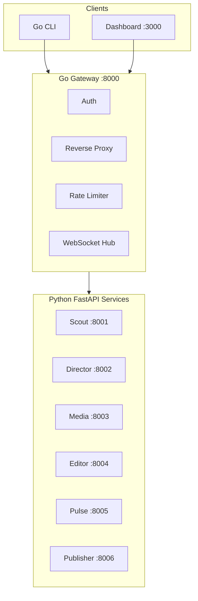

# Services

Orion is composed of nine distinct components: a Go HTTP gateway that serves as the single entry point, six Python FastAPI microservices that handle the AI content pipeline, a Next.js admin dashboard, and a Go CLI for terminal-based control.

All external traffic enters through the Gateway, which handles authentication, rate limiting, and request proxying. The Python services communicate with each other exclusively through Redis pub/sub events — there are no direct HTTP calls between them. This decoupled architecture allows each service to be developed, tested, deployed, and scaled independently.

## :material-view-grid: Service Map



## :material-table: Port Assignments

| Service                   | Port | Language    | Framework           | Description                                        |
| ------------------------- | ---- | ----------- | ------------------- | -------------------------------------------------- |
| [Gateway](gateway.md)     | 8000 | Go 1.24     | Chi 5.x             | HTTP gateway, auth, rate limiting, WebSocket       |
| [Scout](scout.md)         | 8001 | Python 3.13 | FastAPI             | Trend detection from external sources              |
| [Director](director.md)   | 8002 | Python 3.13 | FastAPI + LangGraph | Pipeline orchestration with HITL gates             |
| [Media](media.md)         | 8003 | Python 3.13 | FastAPI             | Image generation (ComfyUI / Fal.ai)                |
| [Editor](editor.md)       | 8004 | Python 3.13 | FastAPI             | Video rendering (TTS, stitching, subtitles)        |
| [Pulse](pulse.md)         | 8005 | Python 3.13 | FastAPI             | Analytics, cost tracking, pipeline history         |
| [Publisher](publisher.md) | 8006 | Python 3.13 | FastAPI             | Social media publishing (Twitter, YouTube, TikTok) |
| [Dashboard](dashboard.md) | 3000 | TypeScript  | Next.js 15.2        | Admin UI with real-time monitoring                 |
| [CLI](cli.md)             | —    | Go 1.24     | Cobra 1.9.x         | Terminal interface for the gateway API             |

## :material-check-circle: Health Endpoints

Every service exposes standardized health endpoints for container orchestration and monitoring:

| Endpoint       | Purpose                                                           | Auth Required |
| -------------- | ----------------------------------------------------------------- | ------------- |
| `GET /health`  | Liveness probe — confirms the process is running                  | No            |
| `GET /ready`   | Readiness probe — confirms dependencies (DB, Redis) are reachable | No            |
| `GET /metrics` | Prometheus-compatible metrics endpoint                            | No            |

Check all services at once through the CLI:

```bash
./bin/orion health --all
```

Or use Docker Compose to inspect container health:

```bash
docker compose -f deploy/docker-compose.yml ps
```

## :material-layers: Shared Library

All six Python services depend on `libs/orion-common/`, a shared library that provides cross-cutting concerns:

- **Config** — `CommonSettings` (Pydantic BaseSettings) with automatic environment variable binding and cached singleton access via `get_settings()`
- **Database** — SQLAlchemy 2.0 async engine, session factory, declarative base models, and migration utilities
- **Events** — `EventBus` for Redis pub/sub with typed event schemas and automatic serialization
- **Logging** — Structured JSON logging via structlog, preconfigured with request IDs and service context
- **Models** — Shared database models, enums (`ContentStatus`, `ProviderMode`), and Pydantic schemas used across services

### Install for local development

```bash
cd libs/orion-common
uv pip install -e ".[dev]"
```

## :material-transit-connection-variant: Event-Driven Communication

Services communicate through Redis pub/sub channels. Each event type follows the naming convention `orion.<domain>.<action>`:

| Event                   | Publisher | Subscriber       | Trigger                               |
| ----------------------- | --------- | ---------------- | ------------------------------------- |
| `orion.trend.detected`  | Scout     | Director         | New trend passes scoring threshold    |
| `orion.content.created` | Director  | Media            | LangGraph pipeline produces content   |
| `orion.media.generated` | Media     | Editor           | Images are ready for video assembly   |
| `orion.media.failed`    | Media     | Director         | Image generation failed (retry logic) |
| `orion.video.rendered`  | Editor    | Pulse, Publisher | Video is ready for review/publishing  |

This architecture means you can restart or scale any individual service without affecting the rest of the pipeline — events are buffered in Redis until consumers are available.
