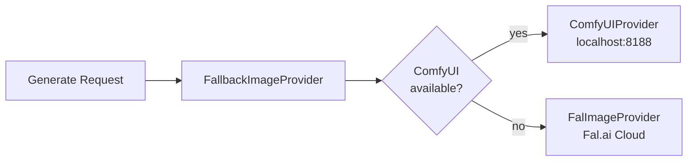

# Media

Image generation service that interfaces with ComfyUI and Fal.ai for text-to-image generation with automatic provider fallback.

| Property         | Value             |
| ---------------- | ----------------- |
| **Port**         | 8003              |
| **Language**     | Python 3.13       |
| **Framework**    | FastAPI           |
| **Source**       | `services/media/` |
| **Route prefix** | `/api/v1/media`   |

## :material-api: Endpoints

### `POST /api/v1/media/generate`

Generate a single image from a text prompt.

**Request body:**

```json
{
  "prompt": "A futuristic cityscape with neon lights",
  "negative_prompt": "blurry, low quality",
  "width": 1024,
  "height": 1024,
  "steps": 30,
  "cfg_scale": 7.5,
  "seed": 42,
  "content_id": "optional-uuid"
}
```

**Response:**

```json
{
  "file_path": "/data/media/img_abc123.png",
  "provider": "comfyui",
  "width": 1024,
  "height": 1024,
  "metadata": {},
  "asset_id": "asset-uuid"
}
```

=== "curl"

    ```bash
    curl -X POST http://localhost:8000/api/v1/media/api/v1/media/generate \
      -H "Authorization: Bearer $TOKEN" \
      -H "Content-Type: application/json" \
      -d '{
        "prompt": "A futuristic cityscape with neon lights",
        "width": 1024,
        "height": 1024
      }'
    ```

=== "Python"

    ```python
    resp = httpx.post(
        "http://localhost:8000/api/v1/media/api/v1/media/generate",
        headers={"Authorization": f"Bearer {token}"},
        json={
            "prompt": "A futuristic cityscape with neon lights",
            "width": 1024,
            "height": 1024,
        },
    )
    result = resp.json()
    ```

---

### `POST /api/v1/media/batch`

Generate multiple images for a content item.

```json
{
  "content_id": "content-uuid",
  "prompts": [
    { "prompt": "Scene 1: Opening shot of city skyline" },
    { "prompt": "Scene 2: Close-up of AI robot" }
  ]
}
```

**Response:**

```json
{
  "content_id": "content-uuid",
  "succeeded": 2,
  "failed_count": 0,
  "results": [...],
  "errors": []
}
```

---

### `GET /api/v1/media/assets/{content_id}`

Get all media assets for a content item.

---

### `GET /api/v1/media/providers`

List available image generation providers and their status.

## :material-image: Provider Chain

The `FallbackImageProvider` implements the Strategy pattern:



| Provider                | Type  | Host             | Description                               |
| ----------------------- | ----- | ---------------- | ----------------------------------------- |
| `ComfyUIProvider`       | LOCAL | `localhost:8188` | Local Stable Diffusion via ComfyUI        |
| `FalImageProvider`      | CLOUD | Fal.ai API       | Cloud-based image generation              |
| `FallbackImageProvider` | CHAIN | --               | Tries ComfyUI first, falls back to Fal.ai |

**Default image dimensions:** 1024 x 1024

## :material-message-arrow-right: Events

| Direction  | Channel                 | Description                    |
| ---------- | ----------------------- | ------------------------------ |
| Published  | `orion.media.generated` | Images generated successfully  |
| Published  | `orion.media.failed`    | Image generation failed        |
| Subscribed | `orion.content.created` | Auto-triggers batch generation |
